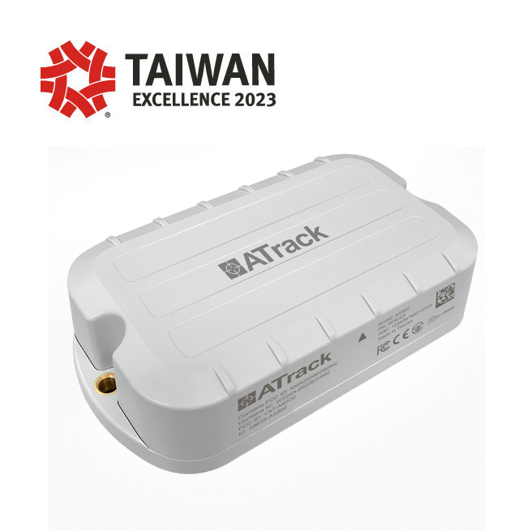

# ATrack - AS500

The AS500 is a rugged, long standby GPS tracker designed for demanding asset tracking applications. Built for environments such as construction sites, mining, logistics yards and other harsh locations, the AS500 combines mechanical protection with a low power architecture and cellular connectivity to provide reliable location and telemetry where long battery life and durability matter.

As an out of the box Plaspy compatible device, the AS500 is engineered to feed Plaspy with high quality location, motion and sensor data. Its mixed indoor/outdoor positioning features and local buffering make it practical for fleet monitoring, anti theft workflows and remote asset management through the Plaspy platform.

## Key Highlights

- Long standby life suitable for unpowered assets, minimizing maintenance frequency.
- Rugged enclosure with strong mechanical protection for harsh environments.
- LTE Cat M1 cellular connectivity for wide area coverage and efficient data delivery.
- 99 channel GNSS receiver plus Wi Fi scanning and BLE 5.1 for improved indoor and outdoor positioning.
- Local data queueing to preserve events during temporary connectivity loss.
- Flexible transport options and device management support for integration and provisioning.

## How It Works with Plaspy

The AS500 transmits and buffers location and sensor data using standard transport methods so Plaspy can present real time location, trigger alerts and retain historical telemetry. Configure reporting behavior and rules in Plaspy while the device focuses on power efficiency and robust delivery.

- Real time location and telemetry updates delivered to Plaspy for live monitoring and mapping.
- Motion, tamper and door events reported to trigger Plaspy alerts and security workflows.
- Wi Fi scanning and BLE sensor inputs provide indoor augmentation and remote sensor visibility in Plaspy dashboards.
- Local queueing of events ensures data is forwarded to Plaspy when connectivity is restored.
- Device management features support remote provisioning and maintenance tied to Plaspy workflows.

## Typical Use Cases

- Container and trailer tracking for long term, unpowered assets in yards and ports.
- Construction and mining equipment monitoring where durability and washdown resistance are needed.
- Generator and heavy equipment location and movement detection for theft prevention.
- Mixed indoor and outdoor asset tracking using GNSS plus Wi Fi and BLE augmentation.
- Logistics yard adjunct tracking to buffer telemetry during connectivity gaps and report to Plaspy when online.

## Why Choose This Tracker with Plaspy

Pairing the AS500 with Plaspy offers a dependable, low maintenance option for organizations that need long battery life and a rugged form factor. The device’s flexible telemetry delivery and local buffering allow Plaspy to maintain continuity of location and event data for operational oversight, reporting and automated alerts.

If your program requires scalable asset or fleet tracking in challenging conditions, the AS500 is a practical match for Plaspy’s monitoring and alerting capabilities. Learn more about Plaspy on the main website https://www.plaspy.com and verify current product specifications and availability with the manufacturer at https://www.atrack.com.tw/ . Product specifications and certifications can change over time, so consult the official manufacturer documentation for the latest details.
