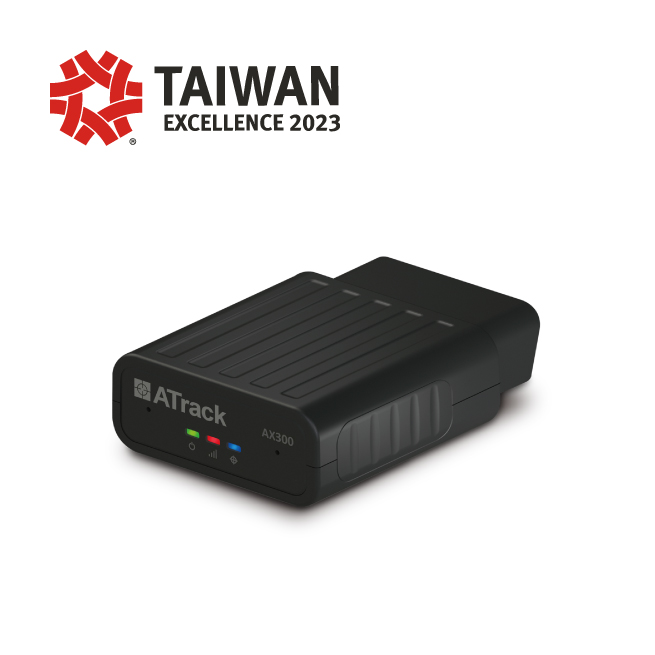

# ATrack - AX300

The AX300 from ATrack is a compact vehicle tracker designed for professional fleet management and vehicle telematics. Intended to connect via the vehicle OBD-II interface, the AX300 provides real-time GNSS location plus engine and diagnostic data, making it suited for operations that need both position and vehicle health visibility. Its design emphasizes deployment in demanding vehicle environments where ongoing telemetry and reliable connectivity matter.

As a Plaspy compatible device, the AX300 can stream location and vehicle diagnostics into Plaspy for unified monitoring, alerts and reporting. That compatibility lets fleet operators combine precise positioning with OBD-derived telemetry inside Plaspy dashboards, enabling operational oversight, maintenance workflows and anti-theft responses without requiring separate systems.

## Key Highlights

- Plaspy compatible for real-time location and diagnostic telemetry integration.
- Direct OBD-II access to vehicle engine and diagnostic parameters for richer fleet insights.
- LTE-M connectivity with regional variants for efficient wide area tracking.
- Dual CAN support and OEM CAN data access for modern vehicle telemetry.
- Robust GNSS performance with high sensitivity and typical meter-level accuracy.
- Vehicle grade durability with wide operating temperature and vibration resistance.
- Optional Bluetooth sensor support to extend situational awareness.

## How It Works with Plaspy

When connected, the AX300 forwards GNSS position fixes and OBD/CAN telemetry into Plaspy so operators can monitor vehicles and analyze historical behavior. Within Plaspy, this data becomes part of map views, event streams and reports that support daily fleet operations.

- Continuous location and historical traces for route analysis and geofencing.
- Engine and ignition status reporting to help assess driver behavior and vehicle state.
- Fuel and diagnostic parameters passed to Plaspy where available from the vehicle for cost and maintenance insight.
- Event driven alerts and notifications based on ignition, movement or diagnostic triggers.
- Bluetooth sensor inputs available in Plaspy to add temperature, door or presence signals for expanded monitoring.

## Typical Use Cases

- Centralized fleet management and logistics with live tracking and route replay.
- School bus and passenger fleet visibility for safety and operator notifications.
- Car sharing and rental operations that need location plus OBD sourced usage data.
- Construction and heavy vehicle deployments requiring ruggedized telemetry in harsh conditions.
- Taxis and on demand services monitoring location and driver related telemetry.

## Why Choose This Tracker with Plaspy

Pairing the AX300 with Plaspy provides a practical route to combine precise GNSS positioning with vehicle diagnostic context, which supports smarter maintenance planning and improved operational control. The OBD-II and dual CAN capability bring deeper vehicle data into Plaspy so teams can act on engine and vehicle state alongside location information.

AX300 is built for scalable vehicle deployments with regional LTE-M variants, device management features and optional Bluetooth expansion to address common fleet requirements. For organizations seeking integrated tracking, diagnostics and alerting in a single platform, the combination of AX300 hardware and Plaspy software offers a concise, manageable solution.

Learn more about Plaspy and how compatible trackers are used with the platform at https://www.plaspy.com. Product specifications, availability and manufacturer details can change over time, so verify current technical information and regional variants on the official ATrack site https://www.atrack.com.tw/.
