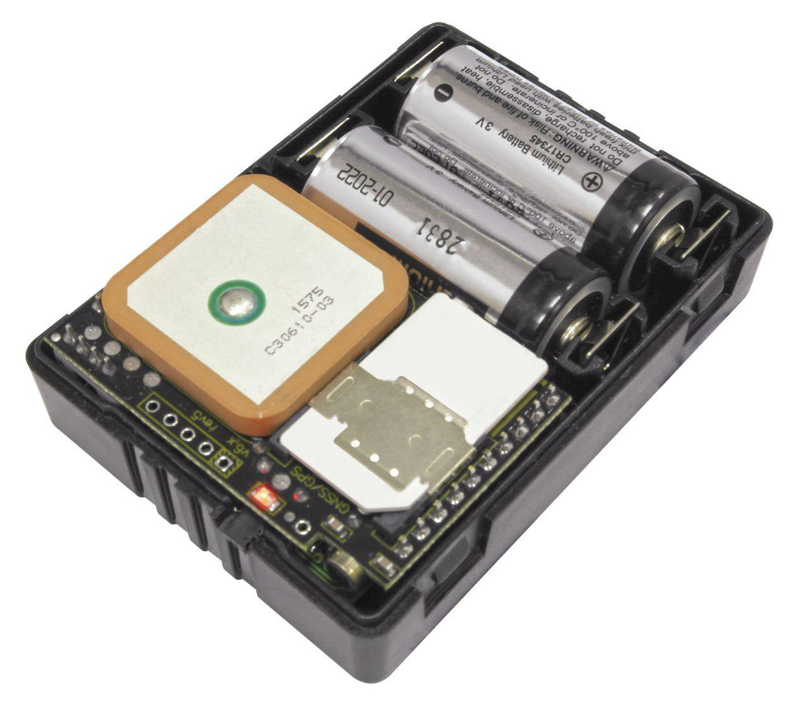

# AutoFon - D-Маяк МОТО

The AutoFon D‑Маяк МОТО is a compact GPS tracker designed for motorcycles and other exposed vehicles that require reliable, long term monitoring. It combines GNSS positioning with GSM GPRS communications, motion and impact detection, and a sealed waterproof housing to support discreet installs, anti theft protection and ongoing telemetry in outdoor conditions. The device also includes local controls such as an SOS button and an internal packet store to improve data reliability.

As a Plaspy compatible device, the D‑Маяк МОТО can transmit position and diagnostic packets to a monitoring server and fall back to SMS when needed, giving Plaspy users access to real time tracking, event alerts and historical data. Its built in buffering and resend logic helps maintain visibility during temporary connectivity gaps, while configurable reporting and remote management features let administrators align device behavior with Plaspy workflows.

## Key Highlights

- Plaspy compatible with GPRS reporting and SMS fallback for flexible server integration
- Compact sealed waterproof housing suitable for motorcycles and exposed installations
- Motion and impact detection with configurable event reporting for timely alerts
- Built in packet storage to reduce data loss and support intermittent connectivity
- Local controls including SOS button and alarm input for safety and remote actions
- Long autonomous operation and power status reporting to reduce maintenance frequency

## How It Works with Plaspy

Integration with Plaspy is straightforward: the tracker sends GPRS packets to your monitoring server and uses SMS as a fallback channel. Plaspy receives these packets to present live location, event alerts and historical playback so operators can monitor movement, respond to incidents and track asset status. The device features onboard storage and resend behavior to minimise gaps in recorded history when connectivity is interrupted.

- Real time location updates and telemetry delivered to Plaspy for live monitoring
- Accelerometer based events such as motion start, impact and tilt forwarded as alerts
- Alarm input and auxiliary channel status visible in Plaspy dashboards for remote control actions
- Battery and external power reports plus configurable heartbeat messages for proactive maintenance
- Internal black box packet storage and resend improve data continuity during outages
- SOS button and audio events can be surfaced in Plaspy for emergency handling and verification

## Typical Use Cases

- Motorcycle anti theft monitoring and recovery with discreet installation and event alerts
- Long term covert asset tracking for trailers, containers and stationary outdoor equipment
- Small motorcycle or scooter fleet tracking with motion based event monitoring and diagnostics
- Personal or compact asset tracking where a sealed device and extended autonomy are required
- Seasonal or intermittent deployments that benefit from reliable buffering and low maintenance

## Why Choose This Tracker with Plaspy

The D‑Маяк МОТО is a practical choice when you need a compact, rugged tracker that balances endurance and dependable telemetry. Its sealed construction and motion aware sensors suit exposed vehicle installs, while the internal packet store and resend logic improve operational reliability for Plaspy users who need consistent history and alerts. Configurable reporting and remote maintenance features help keep devices aligned with evolving monitoring needs.

To explore how the D‑Маяк МОТО can fit into your fleet or asset tracking strategy, learn more about Plaspy on the main website https://www.plaspy.com. Product specifications, availability, and manufacturer details can change over time, so please verify current specifications and official documentation at the manufacturer site https://www.autofon.ru/.
