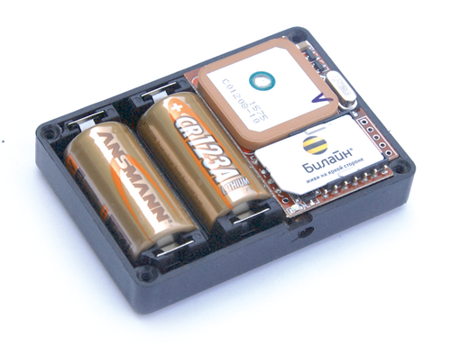

# AutoFon - E-Mayak 3.1

The AutoFon E-Mayak 3.1 is a compact autonomous GPS beacon designed for long term, low maintenance tracking where concealment and battery life are priorities. The device reports position and basic telemetry via SMS and is optimized for intermittent, on demand location checks rather than continuous streaming. Its small form factor and low duty operation make it suitable for discreet placement in vehicles, trailers, containers, boats, and other assets where long autonomy is required.

As a Plaspy compatible model, the E-Mayak 3.1 fits workflows that accept SMS based coordinate links and periodic telemetry. SMS messages from the device can be integrated into Plaspy through manual input or SMS gateway forwarding, allowing visualization, logging, and basic alerting inside Plaspy dashboards without continuous GPRS telemetry. This makes it a practical option for recovery focused tracking, long term unattended monitoring, and occasional status checks within Plaspy environments.

## Key Highlights

- Long autonomous operation with configurable life and sleep cycles for extended standby between maintenance.
- Compatible with Plaspy for on demand location checks using SMS coordinate messages and map links.
- Compact and covert form factor suitable for discreet placement in vehicles and portable assets.
- Deep sleep autonomy reduces detectability and conserves battery while resuming communication when signals return.
- Simple SMS control and PIN protected configuration with no required subscription fees beyond outgoing SMS costs.
- GPS positioning with cell tower fallback to improve location availability in marginal conditions.
- Basic telemetry via SMS including battery status, temperature reports, SIM balance alerts, and heartbeat messages.

## How It Works with Plaspy

The E-Mayak 3.1 communicates location and status primarily by SMS, and those messages can be brought into Plaspy in a few common ways. By forwarding SMS content to an intake channel or by manually importing the provided coordinate or map link text, position reports and status messages become usable inside Plaspy for mapping, reporting, and alerting. This model supports workflows focused on intermittent checks and recovery operations rather than continuous telematics.

- On demand location updates appear in Plaspy after SMS forwarding or manual entry of coordinates or map links.
- SMS telemetry such as battery and temperature can generate monitoring alerts and maintenance reminders in Plaspy.
- Scheduled heartbeat messages help confirm device health and can be used to track compliance with reporting intervals.
- Security related SMS notices like PIN protection events and owner number changes can be logged for audit and alerts.
- Sequential SMS numbering and balance status messages help correlate device messages with Plaspy event logs.

## Typical Use Cases

- Covert vehicle and motorcycle anti theft tracking where discreet placement and long battery life are important.
- Monitoring and recovery of boats, trailers, and remote assets without reliable external power.
- Tracking shipments and cargo containers during storage or transport where minimal detectability is required.
- Periodic personal or animal location checks for temporary monitoring needs.
- Long term unattended asset monitoring where occasional position checks suffice for operational oversight.

## Why Choose This Tracker with Plaspy

The E-Mayak 3.1 is a pragmatic choice for organizations using Plaspy when the priority is long autonomy, concealment, and SMS based on demand tracking. Its SMS control model and compact design make it suitable for recovery oriented deployments and long term asset surveillance where continuous data streaming is not required. When integrated with Plaspy, the device provides clear visibility into position reports and basic telemetry without ongoing GPRS data costs.

If your operational needs center on intermittent location checks, discreet placement, and low maintenance intervals, the E-Mayak 3.1 can be a cost effective addition to Plaspy workflows. Learn more about Plaspy on the main website https://www.plaspy.com and verify current product details and specifications on the manufacturer site https://www.autofon.ru/ since availability and technical specifications can change over time.
