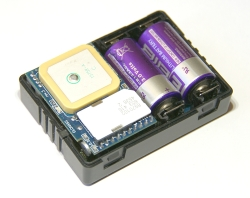

# AutoFon - Маяк 4.5

The AutoFon Маяк 4.5 is a compact GPS tracker designed for long term, low maintenance location monitoring. Intended for discreet installation in vehicles, trailers, boats, cargo and on people or animals, the device combines GPS positioning with GSM connectivity to report location by SMS and to send interval GPRS packets to a chosen monitoring server. Built in motion detection and a built in microphone extend its usefulness for anti theft, covert tracking and safety tasks where periodic updates and reliable alerts are required.

As a Plaspy compatible device, the Маяк 4.5 can deliver position and status messages to Plaspy via SMS or GPRS interval mode, making it straightforward to add this tracker to Plaspy dashboards, alarms and reporting workflows. That compatibility means organizations using Plaspy can ingest the device's location updates, motion and power events and use them for live maps, history trails and operational alerts without complex intermediate steps.

## Key Highlights

- Plaspy compatibility via GPRS interval packets and SMS for server based tracking and alerting
- Designed for long autonomous operation with very low maintenance requirements
- Compact, discreet form factor suitable for covert installation in vehicles and assets
- Built in microphone for remote audio monitoring and situational verification
- Motion detection with an internal accelerometer to trigger movement alerts and save power
- Reports external power disconnects and includes one alarm input plus one auxiliary output
- Simple SMS control with PIN protection and authorized number management for basic remote commands

## How It Works with Plaspy

Integration with Plaspy uses the device ability to push coordinate updates and device status either by SMS or by periodic GPRS packets to a configured monitoring server. Once Plaspy receives those messages it parses position and event data and presents them in maps, timelines and alert lists for operational use.

- Real time location and telemetry on Plaspy maps using GPS coordinates sent by the tracker
- Movement and tamper alerts appear as immediate events so operators can respond quickly
- Power status reporting helps Plaspy flag external power loss or battery only operation
- Remote audio activation can be used for situational verification where local law allows
- SMS based commands let authorized users query device state or request a manual position update

## Typical Use Cases

- Covert vehicle tracking and recovery for cars, motorcycles or boats to support anti theft workflows
- Asset and cargo monitoring where long battery life and compact size minimize maintenance
- Personal safety tracking for people or animals with motion alerts and remote audio capability
- Remote security monitoring of kiosks, outbuildings or unattended equipment for tamper detection
- Small fleet or single asset deployments where periodic telemetry and event alerts are sufficient

## Why Choose This Tracker with Plaspy

The AutoFon Маяк 4.5 is a practical option when long battery autonomy, a small physical footprint and straightforward server connectivity are priorities. It fits Plaspy deployments that emphasize occasional reporting, reliable event alerts and low maintenance rather than continuous high frequency telemetry. Plaspy users can map the device's interval updates and SMS alerts into existing real time dashboards, history reports and alarm rules to support recovery, security and monitoring workflows.

If your requirements focus on stealthy, long term location monitoring with basic telemetry such as location, motion and power state, the Маяк 4.5 is a useful candidate to pair with Plaspy. To learn more about Plaspy and how it handles device integration and fleet monitoring visit https://www.plaspy.com. Please note that product specifications, availability and manufacturer details can change over time and users should verify current specifications on the official manufacturer site https://www.autofon.ru/.
