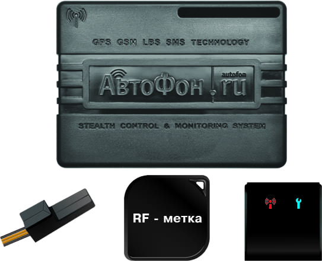

# AutoFon - Микро-Маяк +

The AutoFon Микро‑Маяк + is a highly compact autonomous GPS tracker designed for reliable positioning and standby protection of valuable mobile assets. Combining GLONASS and GPS positioning, GSM GPRS reporting and a short range 868 MHz radio direction finding mode, the unit is intended for continuous visibility of vehicles and portable assets and for improved recoverability in theft or loss scenarios.

As a device that ships Plaspy compatible out of the box, the Микро‑Маяк + integrates into centralized tracking platforms to supply real time locations, motion alerts and historical telemetry. Its small footprint, long standby characteristics and flexible operating modes make it a practical choice for organizations that want compact, remote asset monitoring within the Plaspy environment.

## Key Highlights

- Plaspy compatible tracker for real time asset visibility and recovery workflows.
- Dual GNSS positioning with GLONASS and GPS for broad satellite coverage.
- Compact rugged form factor suited for discreet installations and small vehicle use.
- Long standby autonomy and integrated backup battery for extended offline presence.
- 868 MHz short range radio direction finding to assist recovery in close proximity.
- Built in motion sensing and basic telemetry for event alerts and condition monitoring.

## How It Works with Plaspy

When connected to Plaspy, the Микро‑Маяк + sends regular position and status updates so that operators can monitor assets on live maps, receive alerts and review movement history. Plaspy ingests the device reports to provide centralized dashboards, notifications and reporting that support fleet oversight and recovery actions.

- Live position updates and telemetry appear on Plaspy maps for continuous monitoring.
- Motion and tamper alerts trigger notifications and can be routed into operational workflows.
- Battery and temperature telemetry are available for condition checks and maintenance planning.
- Remote output control and alarm input can be incorporated into Plaspy workflows for basic remote actions.
- Buffered data storage ensures queued reports are delivered to Plaspy once connectivity is restored.

## Typical Use Cases

- Fleet tracking and rental operations for small vehicles, scooters and motorcycles.
- Vehicle anti theft monitoring and rapid recovery using alerts and short range direction finding.
- Protection of leased machinery, remote IT equipment and valuable cargo where small size and long standby matter.
- Covert asset protection for bicycles, ATVs and mobility devices that need discreet monitoring.
- Assistance and location support for personnel or larger pets in mixed environments.

## Why Choose This Tracker with Plaspy

The AutoFon Микро‑Маяк + is a good fit for Plaspy deployments that prioritize compact hardware, long standby capability and multiple positioning fallbacks. By combining satellite positioning, GSM reporting and short range direction finding with built in motion detection and telemetry buffering, the device helps maintain continuous visibility and improves the chances of recovery in real world operational and anti theft scenarios.

If you want to learn more about how Plaspy can use compatible trackers like the Микро‑Маяк + for centralized tracking dashboards, alerts and reporting visit https://www.plaspy.com. Product specifications, availability and manufacturer details can change over time so please verify current specifications and official documentation on the manufacturer site https://www.autofon.ru/.
