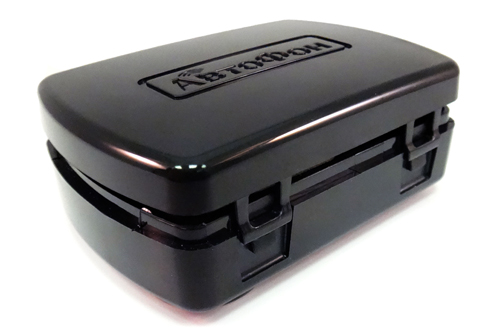

# AutoFon - SE-Маяк

The AutoFon SE-Маяк is a compact, autonomous GPS and GLONASS beacon designed for discreet, long term monitoring of vehicles, assets, and people. It is built for low power consumption and sealed, maintenance free operation, and provides location reports and event messages over GSM based channels. The device includes motion detection, impact detection, a built in microphone for remote audio monitoring, an SOS micro button, and substantial onboard packet storage for later upload.

As a Plaspy compatible tracker, the SE-Маяк can feed its location and event data into Plaspy for real time visibility and historical playback. Its GPRS reporting with SMS fallback and configurable heartbeat and alarm behaviour make it suitable for deployments where long autonomy, covert placement, and reliable delivery of alerts matter. Plaspy can use the device data to build alerts, reports, and operational views that support anti theft and remote monitoring workflows.

## Key Highlights

- Compact sealed housing designed for covert placement and reduced tamper exposure.
- Dual GNSS positioning using GLONASS and GPS for improved satellite coverage.
- Long autonomy suitable for extended deployments without frequent maintenance.
- Motion and impact detection plus SOS button and built in microphone for safety and security alerts.
- GPRS reporting with SMS fallback and large onboard packet buffer to preserve event history.
- Configurable heartbeat and alarm behavior for reliable life sign and alarm reporting.

## How It Works with Plaspy

Plaspy receives the SE-Маяк location and event packets sent over GPRS or SMS and maps them into tracking timelines, alerts, and telemetry dashboards. The device's buffered storage and configurable reporting intervals help ensure Plaspy captures both real time events and delayed uploads after connectivity restoration.

- Real time position updates and history playback in Plaspy when GPRS packets are received.
- SMS fallback and owner alerts routed to Plaspy workflows for immediate notification when needed.
- Motion, impact, and SOS events forwarded to Plaspy so teams can trigger anti theft or emergency procedures.
- Audio monitoring triggers and device life sign messages integrated into Plaspy alerts and timelines.
- Buffered packet upload preserves movement history for Plaspy when the device regains connectivity.

## Typical Use Cases

- Covert vehicle or motorcycle tracking where concealment and long battery life are essential.
- Cargo and container monitoring to capture location history and immediate motion or impact alarms.
- Remote object protection for cabins, boats, kiosks, and other unattended assets requiring low maintenance tracking.
- Personal safety and discreet monitoring for lone workers, family members, or valuables with SOS capability.

## Why Choose This Tracker with Plaspy

The SE-Маяк pairs well with Plaspy when your priority is discreet placement, long battery autonomy, and resilient event delivery. Its combination of GNSS positioning, GSM based reporting, accelerometer driven events, and onboard buffering reduces data loss and supports continuous tracking without frequent servicing. Within Plaspy, that data becomes actionable through alerts, maps, and reporting that support security and fleet oversight.

Because the SE-Маяк focuses on autonomous, sealed operation rather than extensive external integrations, it is especially suitable for asset protection, covert anti theft deployments, and personal safety projects that need low maintenance real time telemetry. Plaspy can incorporate the device's location and event feeds into broader monitoring workflows alongside other fleet or sensor data.

To learn more about how Plaspy can use data from compatible devices like the AutoFon SE-Маяк visit https://www.plaspy.com. Product specifications, availability, and manufacturer details can change over time; please verify current technical information on the manufacturer site https://www.autofon.ru/.
