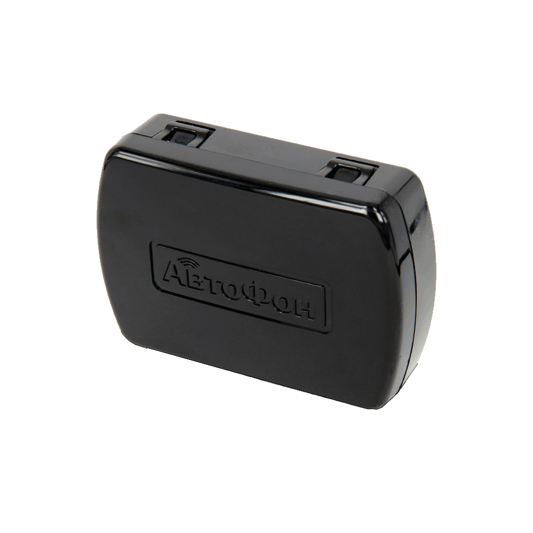

# AutoFon - Омега-Маяк XL

The AvtoFon Mega-Mayak+ device is a powerful GPS tracker designed to accurately determine the location of a protected object using GLONASS/GPS satellite systems. It can transmit the coordinates of the object to the owner via the GSM network through text messages \(SMS\) or to a selected monitoring server via the GPRS protocol. This device is built on the new v8 hardware platform, which has expanded its functionality and improved its performance.

One of the standout features of the AutoFon Mega-Mayak+ is its combined GLONASS+GPS navigation module with A-GPS support, which provides increased location sensitivity. It also features sensors for detecting movement, impacts, accidents, overturns, and falls, with adjustable sensitivity and reactivation intervals. The device supports two SIM cards from different operators, ensuring reliable communication. Additionally, it has a black box that can store up to 15,000 GPRS packets, allowing for detailed tracking and monitoring.

The AutoFon Mega-Mayak+ is suitable for a wide range of applications. Its compact size and long battery life make it ideal for discreetly tracking cars, motorcycles, boats, and other valuable objects. It can also be used to monitor valuable cargo, containers, and even control and locate people, children, and animals. The device can also be used to protect stationary remote objects such as garages, cottages, and shopping pavilions. With its built-in microphone, it can even be used for remote audio monitoring.

With its advanced features and rugged IP67 sealed housing, the AutoFon Mega-Mayak+ is a reliable and versatile GPS tracker that provides accurate location tracking and monitoring capabilities for a variety of applications.

### Outstanding Features:

- GLONASS+GPS navigation module with A-GPS support
- Sensors for movement, impacts, accidents, overturns, and falls
- Two SIM cards from different operators
- Black box for storing up to 15,000 GPRS packets
- SuperStealth Antiscan mode
- Wi-Fi location
- Built-in SOS micro-button
- Remote firmware update function via GPRS
- IP67 sealed housing
- BLE for near-field direction finding and use of the owner’s smartphone as a presence tag
- Photo sensor for dismantling and opening the case
- Micro USB connector for configuration and charging
- Built-in battery capacity of 4000 mAh

