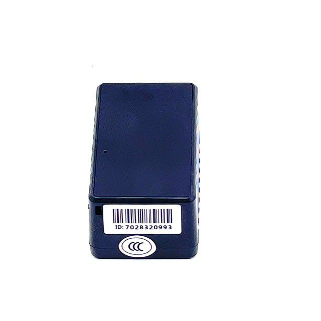

# Autoseeker - AT-07

The Autoseeker AT-07 is a compact GPS mini tracker designed for a wide range of tracking scenarios. It is presented as a small and discreet device suited to monitoring vehicles, trucks, and containers, as well as for personal safety use such as tracking senior citizens or individuals with medical challenges. The AT-07 emphasizes real time location visibility, a user friendly interface for accessing tracking data, and battery longevity to support extended use.

As a device compatible with Plaspy, the AT-07 can be incorporated into Plaspy workflows to deliver centralized visibility and operational oversight. Plaspy users can pair the AT-07 with platform features for map based tracking, basic alerts, and reporting to support fleet management and asset protection. The combination of the AT-07 hardware and Plaspy software gives organizations a straightforward option for everyday tracking needs.

## Key Highlights

- Real time location tracking for continuous visibility of assets and people
- Compact and discreet form factor that is easy to conceal or attach
- Versatile applicability for vehicles, trucks, containers, and personal safety
- User friendly reporting and monitoring through a tracking interface
- Long battery life to reduce the frequency of recharging
- Practical choice for both asset protection and basic fleet oversight

## How It Works with Plaspy

The AT-07 can be brought into the Plaspy platform to provide a single pane of glass for locations and movement history. Within Plaspy, the device appears alongside other trackers so teams can monitor units together, run simple reports, and receive timely notifications relevant to operations.

- View real time device location on Plaspy maps for ongoing situational awareness
- Monitor a fleet or group of assets together for consolidated oversight
- Configure alerts and notifications within Plaspy to highlight important events
- Access trip history and basic reports to support operational review and record keeping
- Group devices and manage visibility to match organizational workflows

## Typical Use Cases

- Fleet tracking for small vehicle and truck fleets
- Container location monitoring for logistics and storage
- Asset protection for high value portable equipment
- Personal safety monitoring for elderly family members or individuals with medical conditions
- Short term rental and equipment tracking for operational control

## Why Choose This Tracker with Plaspy

The AT-07 is a practical option when you need a small, multiuse tracker that integrates into a hosted tracking platform like Plaspy. Its compact design and emphasis on real time visibility make it suitable for organizations that need straightforward location data without complex configuration. Using the AT-07 with Plaspy helps consolidate tracking across vehicles, assets, and people into a consistent operational view.

If you are evaluating trackers for basic fleet oversight or personal safety monitoring, the Autoseeker AT-07 paired with Plaspy is worth considering as a simple, adaptable solution. To learn more about how Plaspy supports device integration and fleet monitoring visit https://www.plaspy.com. Product specifications, availability, and manufacturer details can change over time so please verify current specifications and documentation on the manufacturer site https://autoseekergps.com/.
