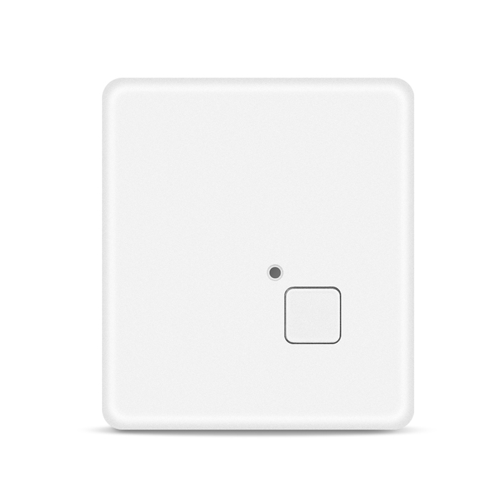

# Autoseeker - AT-1

The AT-1 4G Mini Micro GPS Tracker is a compact, Plaspy compatible personal GPS tracker designed for reliable, long-duration monitoring of children, elderly people, pets, and valuable portable assets. With LTE Cat M1 \(LTE-M\), NB‑IoT \(Cat NB1\) and fallback GSM support, the AT-1 delivers low-power cellular connectivity and precise positioning so caregivers and service providers can rely on real-time tracking, emergency alerts, and long standby times.

Its IP68 waterproof enclosure, small footprint \(46 × 41 × 16 mm\) and lightweight design \(36 g\) make the AT-1 ideal for discreet everyday wear or attachment to belongings. Plaspy-compatible integration brings the device’s telemetry, SOS alerts, geofence events and history playback into a unified dashboard for fast situational awareness and safe, efficient response.

## Key Highlights

- Plaspy compatible GPS tracker optimized for personal safety and discreet asset monitoring.
- Low‑power LTE‑M and NB‑IoT connectivity with GSM fallback for broad network coverage and efficient telemetry.
- Precision GNSS using a Qualcomm Gen 8C receiver with very fast hot start and reliable satellite acquisition.
- Long battery life: up to one year standby under optimized reporting settings, plus a 650 mAh backup cell for extended use.
- Rugged IP68 waterproof housing and magnetic charging for convenient daily use and durability in wet environments.
- Integrated SOS button and multiple work modes \(8 modes\) to balance reporting frequency and battery endurance.
- Real-time tracking, geofence alerts and history playback for continuous situational awareness and incident review.

## How It Works with Plaspy

The AT-1 connects to Plaspy over LTE‑M, NB‑IoT or GSM networks and streams compact telemetry packets that Plaspy ingests for real-time tracking, alerts and historical playback. Once registered in Plaspy, the device’s location fixes, battery status, SOS events and geofence triggers appear in the platform with configurable alerting and reporting intervals. Plaspy’s dashboard and APIs allow caregivers and administrators to visualize movement, run reports, and set up automated notifications.

- Real-time location and telemetry updates routed to Plaspy for continuous monitoring.
- SOS button events delivered as immediate alerts in Plaspy for fast response.
- Geofence creation and breach notifications for boundary-based safety management.
- History playback and trip review to analyze movement and verify events.
- Battery and low‑power alerts so caregivers can schedule charging or replacement before downtime.

## Technical Overview

| Model | AT-1 4G Mini Micro GPS Tracker |
| --- | --- |
| Connectivity | LTE Cat M1 \(LTE‑M\), NB‑IoT \(Cat NB1\), GSM fallback |
| Bands | LTE‑M bands: B1/B2/B3/B4/B5/B8/B12/B13/B18/B19/B20/B26/B28/B39; NB‑IoT bands: B1/B2/B3/B4/B5/B8/B12/B13/B18/B19/B20/B26/B28; GSM 850/900/1800/1900 MHz |
| GNSS | Qualcomm Gen 8C receiver — hot start ~1 s, warm start ~30 s, cold start ~35 s \(average\) |
| Battery | Built‑in backup battery 650 mAh, 3.7 V polymer cell; magnetic charging |
| Power Consumption | Average working current ~37 mA \(4 V\), standby current ~4.5 µA, sleep \<2.2 µA |
| Dimensions & Weight | 46 × 41 × 16 mm; 36 g |
| Durability | IP68 water resistant |
| User Controls & Modes | SOS button; 8 working modes to balance reporting interval and battery life |
| Battery Endurance \(Typical\) | Up to 1 year with 1 report per day; ~39 hours at 1‑minute intervals; ~28 hours at 10‑second intervals |

## Use Cases

- Child safety — real-time tracking and SOS alerts for parents and guardians.
- Elder care and medical monitoring — discreet monitoring for people with dementia, Alzheimer’s, Parkinson’s or other conditions that require location awareness.
- Pet and personal belongings tracking — attach to collars or carry in a bag for theft deterrence and recovery.
- Service providers and caregivers — centralized visibility via Plaspy for coordinated response and history playback.
- Portable asset monitoring — ideal for small, high‑value portable items where compact size and long battery life are critical.

## Why Choose This Tracker with Plaspy

Choosing the AT-1 as a Plaspy compatible GPS tracker gives you a balance of precision, endurance and durability in a very small package. Its LTE‑M and NB‑IoT cellular links provide efficient telemetry for real‑time tracking without frequent charging, and the Qualcomm GNSS ensures fast fixes and reliable positioning. The IP68 rating and magnetic charging make everyday use simple and robust, while multiple work modes let administrators tune reporting for the desired mix of battery life and update frequency.

For organizations and caregivers, Plaspy compatibility means the AT-1’s location, SOS and geofence telemetry flow directly into the platform used for operations, notifications and reporting. Although the AT-1 is optimized for personal safety and asset tracking rather than vehicle telematics, Plaspy’s platform can integrate telemetry with broader workflows — including fleet management dashboards, anti-theft responses and systems that incorporate additional sensors \(for example, fuel monitoring, ignition state, immobilizer controls or Bluetooth sensors\) where those external systems are present. This makes the AT-1 a reliable, scalable choice for teams that need compact GPS trackers with strong battery life, robust connectivity and seamless Plaspy integration.

