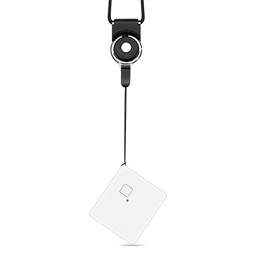

# Autoseeker - AT-1

The Autoseeker AT-1 is a compact, waterproof 4G GPS tracker designed for personal and light asset tracking. It combines a small form factor and an IP68 rating with a professional GNSS positioning module to provide precise location information. The AT-1 is battery powered and offers multiple work modes, including real time tracking, history tracking, and geofence alerts, making it suitable for monitoring children, elderly family members, pets, and other small mobile assets.

As a device compatible with Plaspy, the AT-1 can feed location and status data into the Plaspy fleet and tracking platform for live visibility and historical review. Its low power design and support for wide area cellular technologies make it a practical choice for deployments where battery life and reliable outdoors performance matter. When used with Plaspy, the AT-1 extends Plaspy capabilities into compact personal tracking and light asset monitoring scenarios.

## Key Highlights

- Small and lightweight design with dimensions around 46 x 41 x 16 mm and a weight near 36 g for discreet placement
- IP68 rated housing for reliable outdoor and wet weather use
- Rechargeable battery with usage scenarios that can range from hours of frequent reporting to extended standby for periodic updates
- Multiple operating modes including real time tracking and history playback to support different monitoring needs
- Built on Qualcomm GNSS positioning for accurate location fixes
- Supports wide area cellular connectivity technologies to provide broad network reach
- Geofence function for entry and exit alerts around predefined areas

## How It Works with Plaspy

When connected to Plaspy, the Autoseeker AT-1 streams its location and status updates into the Plaspy platform where teams can monitor movement, review history, and receive alerts. Plaspy ingests the device data and presents it in dashboards and reports that help with operational oversight and safety monitoring.

- Real time location display in Plaspy for continuous visibility of the tracked unit
- Geofence alerting within Plaspy to notify users when the tracker enters or leaves configured zones
- History tracking and route playback in Plaspy for incident review and movement analysis
- Device status reporting to help assess battery condition and online presence
- Notifications and configurable alerts to keep teams informed of important events
- Aggregated reporting for operational insights when multiple AT-1 units are deployed

## Typical Use Cases

- Monitoring the whereabouts of children during outings or transit
- Tracking elderly family members or individuals with medical needs for enhanced safety
- Locating and checking on pets while away from home
- Discreet tracking of small assets or personal items that require periodic location checks
- Short term rental or shared equipment tracking where compact waterproof devices are preferred

## Why Choose This Tracker with Plaspy

The Autoseeker AT-1 is a practical option for organizations and families that need a small, weather resistant tracker with flexible reporting modes. Its combination of compact size, long standby potential, and standard positioning accuracy makes it well suited to personal safety and light asset scenarios. When paired with Plaspy, the AT-1 becomes part of a broader monitoring and reporting workflow, enabling teams to receive alerts, review location history, and manage units at scale.

While the AT-1 provides many useful attributes for personal and light commercial tracking, deployment requirements vary by use case. Learn more about how Plaspy can integrate devices like the Autoseeker AT-1 and support your tracking needs by visiting https://www.plaspy.com. For the latest product specifications availability and manufacturer documentation please verify details on the official Autoseeker site https://autoseekergps.com/
