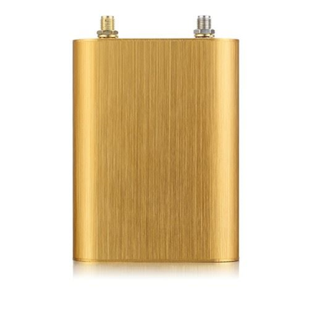

# Autoseeker - AT-10

The Autoseeker AT-10 is a cutting-edge GPS tracker designed to provide real-time tracking and monitoring for vehicles. With its 4G LTE network support, you can enjoy fast and reliable connectivity, ensuring that you always have access to accurate location information. Whether you're tracking a fleet of vehicles or monitoring the whereabouts of a single car, the AT-10 has you covered.

One of the standout features of the Autoseeker AT-10 is its ability to provide detailed vehicle trip history and mileage data. This allows you to keep track of the routes taken by your vehicles and monitor their overall usage. Additionally, the AT-10 offers a range of alarm reporting features, including SOS alarm reporting, ACC switch status report, geo-fence alarm and reporting, external power cut off alarm, and more. These features help to enhance the security and safety of your vehicles, giving you peace of mind.

With the Autoseeker AT-10, you can also take advantage of optional features such as remote cut off fuel/ignition, vehicle towing/movement alarm, and over-speed alarm and reporting. These additional functionalities allow you to have greater control over your vehicles and ensure that they are being used responsibly. The AT-10 also includes a backup battery low power alarm and car battery low power alarm, so you'll always be alerted when power levels are running low.

Overall, the Autoseeker AT-10 is a reliable and feature-packed GPS tracker that offers real-time tracking, detailed trip history, and a range of alarm reporting features. Whether you're a fleet manager or a concerned vehicle owner, the AT-10 is an excellent choice for keeping tabs on your vehicles and ensuring their safety and security.

### Outstanding Features:

- 4G LTE network support
- Real-time tracking
- Vehicle trip history and mileage data
- SOS alarm reporting \(optional\)
- ACC switch status report
- Geo-Fence alarm and reporting
- External power cut off alarm
- Remote cut off fuel / ignition \(optional\)
- Vehicle towing / Movement alarm
- Over-Speed alarm and reporting
- Backup battery low power alarm
- Car battery low power alarm
- Power saving / sleep mode
- 4G LTE CAT 1\(fallback to 3G/2G\)
- SOS button allows rapid emergency alert
- Towed alert
- 4G Module certificate

