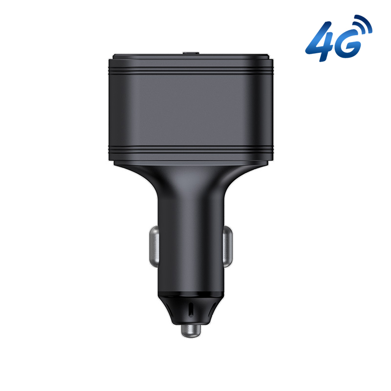

# Autoseeker - AT-11

The Autoseeker AT-11 is a compact plug and play 4G car charger GPS tracker designed for quick deployment in vehicles. Intended to be used in a cigarette lighter socket, the device combines GNSS positioning with cellular connectivity and an integrated mobile phone charging function to provide continuous location updates, alarm reporting and history playback without hardwiring. Its form factor and lightweight enclosure make it practical for fleets, rental vehicles and private cars where simple installation and immediate tracking are priorities.

As a Plaspy compatible device, the AT-11 feeds location and event data into Plaspy enabled tracking servers so fleet managers and operators can use Plaspy dashboards for live maps, alerts and reporting. The combination of real time tracking, geo fence and overspeed notifications, and power loss or unplug alerts makes the AT-11 a relevant option for organizations and individuals who want rapid deployment of tracking services through Plaspy without complex installation work.

## Key Highlights

- Plug and play cigarette lighter installation for fast deployment across fleets and rental vehicles.
- Dual function design combining GNSS tracking with an integrated mobile phone charging port for driver convenience.
- Global 4G connectivity with 2G fallback for broad network reach and continuous reporting.
- GPS plus Beidou positioning with positioning accuracy reported under 10 m for dependable location updates.
- Comprehensive security alarms including geo fence, overspeed, movement or towing, vibration and unplug or power failure alerts.
- Built in backup battery and low power consumption to preserve short term operation and safe shutdown after power loss.
- Compact, durable ABS enclosure and internal antennas for a low profile vehicle installation.

## How It Works with Plaspy

When connected to a compatible network, the AT-11 transmits GNSS positions and event telemetry to Plaspy capable tracking servers in real time. Plaspy presents that data on live maps, routes and timelines, and uses configurable rules to generate notifications and reports that support operational oversight.

- Real time location and telemetry updates visible on Plaspy live maps for dispatch and monitoring.
- Geo fence and overspeed alerts delivered to Plaspy for instant notifications and audit trails.
- Movement, towing, vibration and unauthorized ignition alerts routed into Plaspy for anti theft and incident response.
- Power failure and unplug notifications plus backup battery status shown in Plaspy to track device health.
- Event history and playback available in Plaspy for trips, incidents and compliance reporting.

## Typical Use Cases

- Fleet management for continuous tracking, route oversight and driver behavior alerts.
- Insurance telematics programs for mileage and event history with tamper and power loss indicators.
- Anti theft and vehicle security monitoring using unplug and movement alarms routed to an operations center.
- Dealerships and rental or taxi operations needing quick swap in tracking for inventory and short term assignments.
- Individual vehicle owners who want discreet tracking combined with a convenient in car charger.

## Why Choose This Tracker with Plaspy

The AT-11 is well suited to environments where speed of deployment and practical convenience matter. Its plug in charger form factor reduces installation time and makes it easy to move between vehicles, while the combination of GNSS positioning and cellular connectivity enables continuous reporting into Plaspy for live oversight. Security focused alarms and short term backup power add useful layers of protection and operational visibility without requiring a permanent install.

For teams using Plaspy, the AT-11 provides an approachable option to add location intelligence across mixed fleets or short term vehicle programs. Its design balances everyday convenience with the core tracking and alerting features that feed Plaspy workflows for notifications, history playback and reporting.

Learn more about Plaspy and how compatible devices like the AT-11 can be used with the platform at https://www.plaspy.com. Product specifications and availability can change over time; verify current technical details and the latest documentation on the manufacturer website https://autoseekergps.com/.
