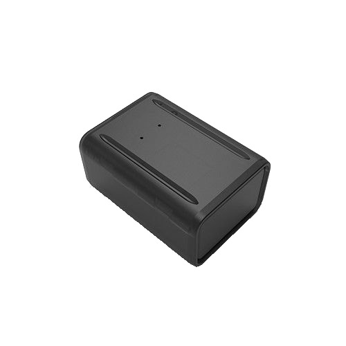

# Autoseeker - AT-14

The Autoseeker AT-14 is a wireless Mini GPS Tracker designed for use in vehicles, trucks, and containers. With its long-time standby feature, this tracker ensures reliable and continuous tracking without the need for frequent recharging. 

One of the standout features of the AT-14 is its powerful magnets, which provide a whopping 300 pounds of pull. This means that you can easily mount the tracker to various surfaces, including vehicles, planes, watercraft, industrial vehicles, construction equipment, cargo containers, and more. The strong magnetic attachment ensures a secure and stable connection, allowing you to track valuable assets with confidence.

In addition to its impressive mounting capabilities, the AT-14 offers reliable and accurate GPS tracking. It utilizes 2G technology to provide real-time location updates, allowing you to monitor the movement and whereabouts of your vehicles or containers. Whether you're managing a fleet of trucks or tracking valuable cargo, this GPS tracker is a reliable and efficient solution.

With its compact and portable design, the Autoseeker AT-14 is easy to install and use. It is equipped with a long-lasting battery that ensures extended standby time, minimizing the need for frequent recharging. This makes it an ideal choice for long-term tracking applications where continuous monitoring is required.

Overall, the Autoseeker AT-14 is a versatile and reliable GPS tracker that offers powerful magnetic mounting, long-time standby, and accurate tracking capabilities. Whether you need to track vehicles, trucks, or containers, this tracker is designed to meet your needs and provide peace of mind.

