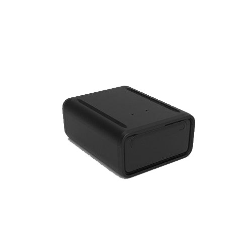

# Autoseeker - AT-15

The Autoseeker AT-15 is a compact GPS mini tracker designed to provide location monitoring for a range of applications. Its form factor and feature focus make it suitable for tracking vehicles, trucks, containers, and individuals. The AT-15 offers real time location reporting and geofencing capabilities, delivering the basic location oversight needed for operational tracking and personal safety monitoring.

As a Plaspy compatible device, the AT-15 can be used with Plaspy's fleet and asset management tools to bring that location data into a unified platform. Plaspy compatibility means organizations can include AT-15 devices in their existing dashboards to improve visibility, receive geofence alerts, and integrate tracked units into fleet reporting and operational workflows.

## Key Highlights

- Compact GPS mini tracker suitable for vehicles, containers, and personal use
- Real time tracking for continuous location visibility
- Supports monitoring of senior citizens and persons with medical challenges
- Geofencing capabilities with instant entry and exit notifications
- User friendly mobile app and web platform for basic monitoring
- Portable design that fits a variety of tracking scenarios

## How It Works with Plaspy

When connected into Plaspy, the AT-15 becomes one of the devices feeding location and status information into a central tracking environment. Plaspy aggregates the incoming data to provide map views, alerts, and historical location records that fleet managers and caregivers can use for oversight.

- Visualize AT-15 units on Plaspy maps alongside other devices for consolidated situational awareness
- Configure geofence alerts in Plaspy to receive notifications when an AT-15 enters or leaves a predefined area
- Monitor movement history and recent location points through Plaspy reporting tools
- Use Plaspy notifications and alerting to drive operational responses or caregiver notifications
- Include AT-15 units in routine fleet or asset status checks within Plaspy dashboards

## Typical Use Cases

- Fleet tracking for light vehicles and small trucks where compact trackers are preferred
- Container and portable asset monitoring during transport and storage
- Safety and location monitoring for elderly people or individuals with cognitive or mobility challenges
- Basic asset recovery and perimeter control using geofence alerts
- Lightweight deployments where a small form factor tracker is needed

## Why Choose This Tracker with Plaspy

The Autoseeker AT-15 is a practical choice when you need a small, versatile tracker that covers common location monitoring requirements. Its focus on real time tracking and geofencing makes it a straightforward option for organizations that require clear location visibility without complex instrumentation.

Paired with Plaspy, the AT-15 can be added to broader fleet and asset monitoring workflows to improve operational oversight and reduce the time to detect location events. Because the AT-15 is compact and intended for general tracking scenarios, it can be a good fit for mixed fleets, personal safety programs, and asset monitoring where simple, reliable location reporting is the priority.

Learn more about Plaspy and how compatible devices like the Autoseeker AT-15 can fit into your tracking strategy at https://www.plaspy.com. Product specifications, availability, and manufacturer details can change over time, so please verify current information on the manufacturer website https://autoseekergps.com/.
