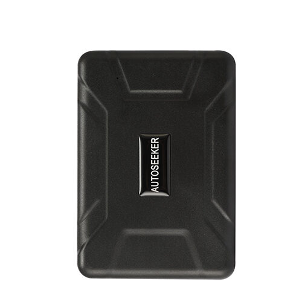

# Autoseeker - AT-17

The AT-17 is a heavy duty 2G wireless GPS tracker designed for vehicles, trucks, containers and other high value mobile assets. It combines a rugged waterproof enclosure with six integrated magnets for secure mounting and a very large 10000 mAh internal battery, enabling long deployments where covert and reliable location tracking is required. The device includes motion detection, remove and shake alarms, low battery alerts and a remote monitor function to support security and recovery scenarios.

As a Plaspy compatible device, the AT-17 can forward location and alarm reports into Plaspy for centralized monitoring, historical playback and fleet management workflows. Integration options such as SMS or GPRS reporting make the device straightforward to add to Plaspy instances so operations teams, recovery services and fleet managers can use Plaspy’s maps, alerts and reporting to act on location intelligence.

## Key Highlights

- Plaspy compatible device for centralized real time tracking and archived playback.
- Very large 10000 mAh internal battery for extended standalone deployments.
- Rugged waterproof enclosure with six integrated magnets for secure magnetic mounting.
- Quad band GSM GPRS support for SMS and GPRS based reporting and locate on demand.
- Security focused alarms including motion detection, remove alarm, shake alarm and low battery warnings.
- Remote monitor listening function to assist in recovery verification and situational awareness.

## How It Works with Plaspy

When configured to report via SMS or GPRS, the AT-17 sends periodic location updates and alarm messages that Plaspy ingests and presents in the platform. Once data arrives in Plaspy, teams can monitor assets in real time, review historical tracks and build alerting or reporting workflows to match operational needs.

- Real time tracking and map visualization for live fleet oversight.
- Locate on demand via device request with results visible in Plaspy and map views.
- Alarm forwarding to trigger Plaspy notifications and incident workflows for theft response or maintenance alerts.
- Historical playback and archived tracks for route analysis, audits and incident investigation.
- Consolidated reporting across multiple AT-17 units for operational insight and compliance.

## Typical Use Cases

- Fleet anti theft and recovery for trucks, trailers and service vehicles.
- Cargo and container logistics where long battery life and magnetic mounting enable temporary tracking.
- Construction and heavy equipment monitoring during projects or storage periods.
- Short term rentals and asset visibility for high value equipment that cannot be permanently installed.

## Why Choose This Tracker with Plaspy

The AT-17 pairs long standby capability and a rugged form factor with straightforward SMS and GPRS reporting, making it a practical choice for organizations that need low maintenance, covert or temporary tracking tied into a centralized platform. Using the AT-17 with Plaspy brings device level alarms and location data into a single system for consistent monitoring, faster recovery actions and consolidated reporting.

Learn more about how Plaspy can manage Autoseeker trackers and support your fleet on the Plaspy website https://www.plaspy.com. Product specifications and availability can change over time; please verify current device details and the latest technical documentation with the manufacturer at https://autoseekergps.com/ before purchase or deployment.
