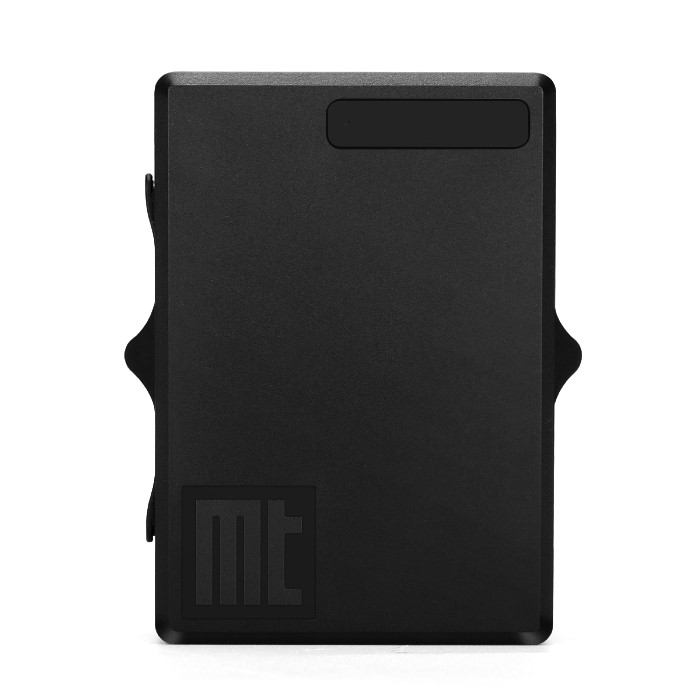

# Autoseeker - AT-17F

The AT-17F is a rugged, long‑life GPS tracker designed for reliable remote monitoring in harsh environments and is Plaspy compatible out of the box. Built for unattended deployments, the AT-17F combines ultra‑low power consumption, IP68 waterproofing and a powerful magnetic mount to deliver real‑time tracking and telemetry for trailers, containers, construction equipment, watercraft and other mobile assets.

With LTE Cat M1 and NB‑IoT connectivity plus fallback 2G, the AT-17F gives wide regional coverage while preserving battery life for multi‑year operation. Plaspy users benefit from rapid time‑to‑first‑fix GNSS positioning, geo‑fence and tamper alerts, scheduled reporting, and an open protocol that simplifies integration into fleet management, anti‑theft and broader telematics workflows.

## Key Highlights

- Plaspy compatible GPS tracker for reliable real‑time tracking and telemetry on LTE Cat M1, NB‑IoT and 2G networks.
- Extreme low power profile—sleep consumption ~1.45–1.5 µA—enables multi‑year battery life on primary cells or extended operation on a rechargeable pack.
- IP68 rated enclosure and ~300 lb magnetic mount for secure attachment to trailers, containers and equipment in demanding conditions.
- Qualcomm Gen8C GNSS with multi‑mode positioning \(GPS + Wi‑Fi + LBS + A‑GPS\) and fast TTFF \(hot ~1s, warm ~30s, cold ~35s\).
- Flexible power options: selectable non‑rechargeable primary cells \(multi‑year standby\) or a rechargeable 3.7V 7800 mAh battery \(≈2 years with daily reports\).
- Rich telematics feature set including geo‑fence alerts, low battery warnings, removal/tamper alerts, smart motion detection and scheduled reporting.
- Open protocol and multi‑platform support \(Traccar, Navixy, Gurtam, GPSWOX, GpsGate, GPS‑Server, OpenGTS\) for seamless Plaspy integration and third‑party telemetry aggregation.

## How It Works with Plaspy

When connected to Plaspy, the AT-17F streams precise location fixes and event telemetry to the platform for real‑time tracking, alerting and historical reporting. Plaspy users can configure reporting intervals, geo‑fences and alert thresholds to match fleet management, anti‑theft and asset supervision requirements while benefiting from the AT‑17F’s extended battery life and waterproof design.

- Real‑time location and telemetry updates delivered to Plaspy via LTE Cat M1 / NB‑IoT or fallback 2G networks.
- Geo‑fence entry/exit alerts, removal/tamper notifications and low battery warnings pushed to Plaspy for instant action.
- Scheduled reporting and smart motion detection to maximize battery life while preserving timely position updates for fleet management and asset tracking.
- Remote programming and firmware workflows via web, USB or SMS to adapt device behavior for Plaspy dashboards and rules.
- Open device protocol and native support for popular telematics platforms eases integration; Plaspy can also combine AT‑17F feeds with other data sources \(CANbus gateways, third‑party sensors\) to enable fuel monitoring, ignition/immobilizer workflows or Bluetooth sensors where such inputs are available through integrations.

## Technical Overview

| Connectivity | LTE Cat M1 \(eMTC\) and NB‑IoT with fallback 2G GSM |
| --- | --- |
| Bands | GSM/Cat M1/NB‑IoT support across multiple regional bands \(model variants for regional coverage\) |
| Power & Battery | Selectable rechargeable or non‑rechargeable batteries; up to 7 years standby on disposable primary cells, ~2 years on rechargeable 3.7V 7800 mAh with daily reporting; Quick Charge micro‑USB 2A @ 5V; dynamic power path management |
| Interfaces | Internal Micro 3FF SIM slot, micro‑USB charging and programming, configurable via web, USB or SMS |
| GNSS | Qualcomm Gen8C GNSS receiver; GPS + Wi‑Fi + LBS + A‑GPS; TTFF: hot ≈1s, warm ≈30s, cold ≈35s |
| Bluetooth | No Bluetooth interface reported in the specification |
| Remote Management | Programmable via web, USB or SMS; open protocol for third‑party integrations and supported by major telematics platforms |
| Form Factor | Compact rugged housing, 88 × 62 × 34 mm, 290 g; IP68 ingress protection; strong magnetic mount \(~300 lb pull\) |

## Use Cases

- Trailer and container tracking: long battery life and waterproof design make the AT‑17F ideal for long‑dwell assets and intermodal shipping.
- Fleet and logistics monitoring: integrate device telemetry with Plaspy for route visibility, geo‑fencing and exception reporting.
- Construction equipment and heavy machinery: secure magnetic mounting and tamper alerts protect high‑value assets on remote sites.
- Automobile finance and asset recovery: persistent reporting, removal alerts and platform integration support anti‑theft workflows and recovery coordination.
- General asset management: multi‑year battery options and scheduled reporting reduce maintenance visits for widely dispersed assets.

## Why Choose This Tracker with Plaspy

The AT‑17F is designed for operators who require dependable, long‑duration telemetry and real‑time tracking with minimal maintenance. As a Plaspy compatible GPS tracker, it combines ultra‑low power consumption, rugged IP68 protection and secure magnetic mounting to reduce operational overhead and risk. Its Qualcomm GNSS performance and rapid TTFF provide accurate fixes for fleet management and anti‑theft monitoring, while open protocol support and existing platform compatibility simplify integration into Plaspy environments.

Choose the AT‑17F with Plaspy when you need a waterproof, low‑maintenance asset tracker that delivers reliable telemetry, scalable fleet management features and flexible integration options—while enabling future expansion to sensor feeds or vehicle data streams \(fuel monitoring, ignition/immobilizer workflows, Bluetooth sensors\) via gateways and platform integrations.

