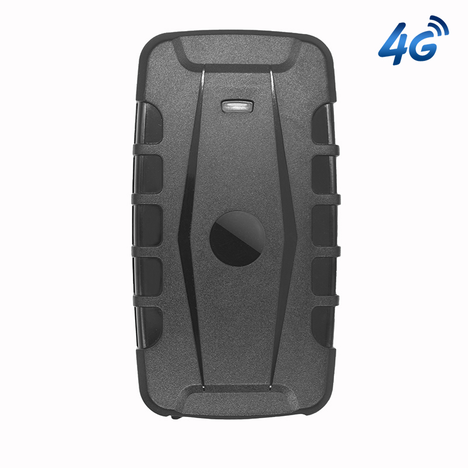

# Autoseeker - AT-17G

The Autoseeker AT-17G is a heavy duty 4G GPS asset tracker designed for long term asset protection and fleet management. It combines robust physical construction with a high capacity rechargeable battery and six internal high strength magnets to enable covert mounting on trucks, trailers, containers, construction machinery and other high value mobile assets. The device is built to withstand demanding transport environments and provide persistent position updates and event notifications.

As a Plaspy compatible device, the AT-17G can feed location and telemetry into the Plaspy platform to support tracking dashboards, alerts and operational workflows. Its long battery runtime, rugged IP65 housing and support for movement and geofence alerts make it a practical option for organizations that want to add durable, portable tracking to their Plaspy deployment for theft prevention, route oversight and scalable fleet monitoring.

## Key Highlights

- 4G connectivity for timely position updates and lower latency tracking.
- Large 20000mAh rechargeable battery for extended standby between charges.
- Six internal high strength magnets for secure, covert mounting on metal assets.
- IP65 rated construction suitable for outdoor use in transport and logistics.
- Movement, geofence and low battery alerts to support anti theft and monitoring.
- Remote audio monitoring capability to assist investigations and recovery.
- Multiple low power work modes to extend operational life and reduce maintenance frequency.

## How It Works with Plaspy

When integrated with Plaspy, the AT-17G supplies consistent location fixes and event information into Plaspy dashboards and reporting tools so teams can maintain situational awareness and respond to incidents. Plaspy ingests position, event flags and battery status from the device and makes that data available for mapping, alerting and history analysis.

- Real time location updates appear on Plaspy maps for live tracking and dispatching.
- Movement, overspeed and geofence events are delivered to Plaspy for automated notifications and escalation.
- Low battery and status alerts help schedule maintenance and reduce unexpected downtime.
- History playback and trace checking in Plaspy support incident investigation and route analysis.
- Remote audio monitoring data can be surfaced through Plaspy compatible interfaces to aid verification.
- Where vehicle telematics or external interfaces are available, AT-17G signals can be used within Plaspy workflows alongside other telematics streams.

## Typical Use Cases

- Covert tracking of trailers and containers for anti theft and recovery operations.
- Long duration monitoring of construction equipment and heavy machinery during projects.
- Fleet oversight for trucks and support vehicles where extended battery life reduces servicing.
- Chain of custody and cargo tracking across land and short sea transport legs.
- Portable deployment for high value asset protection during storage or transit.

## Why Choose This Tracker with Plaspy

The AT-17G is suited to organizations that need a durable, low maintenance tracking option that integrates into a unified monitoring platform. Its combination of extended battery life, secure magnetic mounting and weather resistant housing reduces servicing needs while providing reliable position and event data into Plaspy for operational decision making.

If you want to evaluate the AT-17G for your Plaspy deployment, learning more about Plaspy on the main website https://www.plaspy.com is a good next step. Product specifications and availability can change, so please verify current technical details and compatibility on the manufacturer website https://autoseekergps.com/ before purchase or deployment.
