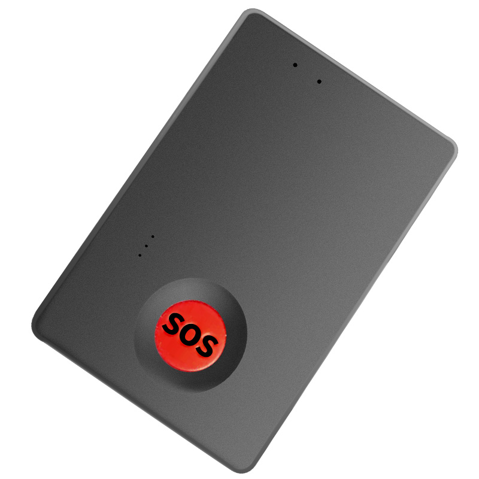

# Autoseeker - AT-2

The AT-2 4G Mini GPS Tracker by AT-2 manufacturer \(marketed as the Best Mini GPS Tracker\) is a compact, Plaspy compatible GPS tracker built for continuous personal safety and portable asset monitoring. With full-band 4G LTE-FDD and fallback 2G support, GPS + Beidou positioning, two-way voice and SOS emergency calling, the AT-2 delivers reliable real-time tracking and timely alerts for caregivers, security teams and light asset managers.

Designed for discreet attachment to clothing, luggage or equipment, the AT-2 combines long standby performance \(up to 200 days in power-save mode\) with an IP65 water-resistant enclosure and a rich alarm suite for anti-theft and safety use cases. When integrated with Plaspy, the AT-2 feeds accurate location, telemetry and alarm events into a secure platform for monitoring, reporting and responsive action.

## Key Highlights

- Plaspy compatible for smooth integration into real-time tracking and fleet management dashboards.
- Full-band 4G LTE-FDD with GSM fallback ensures wide-area connectivity for continuous GPS tracking.
- GPS + Beidou positioning with MTK2503 chipset and ~5 m accuracy for reliable location fixes.
- Two-way voice, SOS emergency calling and remote listening for caregiver–wearer contact and rapid response.
- Long battery life: 3.7V 1500mAh rechargeable battery with exceptional standby performance in power-save mode.
- Comprehensive intelligent alarms including tamper, vibration/movement, displacement, overspeed and low battery alerts for anti-theft and safety monitoring.
- Compact, lightweight and IP65-rated housing with magnetic attachment option for flexible mounting on portable assets.

## How It Works with Plaspy

When paired with Plaspy, the AT-2 becomes a Plaspy compatible endpoint that delivers position updates, status signals and alarms into the Plaspy platform in near–real time. Positioning and telemetry are uploaded over cellular networks to Plaspy where users can view live location, generate reports and configure automated alerts. Caregivers and fleet supervisors can use Plaspy to centralize data, trigger workflows and respond to SOS or tamper events quickly.

- Real-time location and telemetry updates \(GPS + Beidou fixes streamed via 4G/2G\).
- SOS emergency alerts, two-way voice calls and remote listening/monitoring for immediate situational awareness.
- Intelligent alarm reporting: tamper/dismantle, vibration/movement, displacement and overspeed events forwarded to Plaspy.
- Battery state and power-save notifications so Plaspy can alert before the device goes offline.
- Remote configuration support through compatible tracking platform APIs and settings when integrated with Plaspy.

## Technical Overview

| Connectivity | 4G LTE-FDD and GSM \(fallback\) cellular connectivity |
| --- | --- |
| Bands | LTE-FDD: B1/B2/B3/B4/B5/B7/B8/B28/B66; GSM: B2/B3/B5/B8 \(850/900/1800/1900 MHz\) |
| Power & Battery | Rechargeable 3.7V 1500mAh Li battery; standby up to ~200 days in power-save mode; save mode ~5 µA, sleep mode ~15 µA, smart work mode ~60 mAh; working current avg. 35 mA \(4V\) |
| Interfaces & Features | Two-way voice, SOS emergency call, remote listening/monitoring, remote pickup/recording, Micro SIM slot, magnetic attachment; battery-powered charging |
| GNSS | MTK2503 chipset; GPS + Beidou positioning; positioning accuracy approx. 5 meters; cold start ~35 s, warm ~30 s, hot ~1 s \(avg.\) |
| Bluetooth | Not specified / N/A in supplied specifications |
| Remote Management | Supports remote configuration and monitoring through compatible tracking platforms and OEM integrations \(Plaspy compatible\) |
| Form Factor | Compact: 57 x 39 x 17 mm; weight 40 g; IP65 water resistance; battery-powered, magnet-attachable |

## Use Cases

- Personal safety monitoring for children, seniors or people with medical conditions — SOS calling, two-way voice and remote listening enable rapid caregiver intervention.
- Lightweight asset tracking for luggage, backpacks or portable equipment where a discreet, magnet-attachable GPS tracker is needed.
- Short-term vehicle or boat tracking when a compact tracker is preferable for temporary deployments or covert attachment.
- Anti-theft monitoring with tamper, displacement and vibration alarms routed to Plaspy for fast incident response.
- Field personnel check-ins and remote telemetry for use in small-scale fleet management scenarios where detailed vehicle telematics \(ignition, fuel monitoring, immobilizer\) are not required.

## Why Choose This Tracker with Plaspy

The AT-2 is a purpose-built, Plaspy compatible GPS tracker that balances compact design, long battery life and dependable connectivity. Its two-way voice and SOS features add a human layer to automated telemetry, making it especially suitable for caregiver-driven deployments and safety-focused applications. The device’s wide 4G band coverage and GPS + Beidou positioning provide stable real-time tracking, while the broad alarm suite supports anti-theft and situational awareness needs.

For organizations that want rapid deployment and simple day-to-day management, the AT-2 integrates with Plaspy to provide centralized alerts, reporting and remote configuration. Note: the AT-2 emphasizes personal and portable asset tracking and telemetry—features such as dedicated fuel monitoring, ignition sensing or immobilizer control are outside the supplied specification. If your project requires those specific vehicle telematics functions or Bluetooth sensor integration, Plaspy can also support other compatible devices tailored for ignition, fuel or immobilizer workflows while keeping the AT-2 as a cost-effective option for anti-theft and personal safety tracking.

