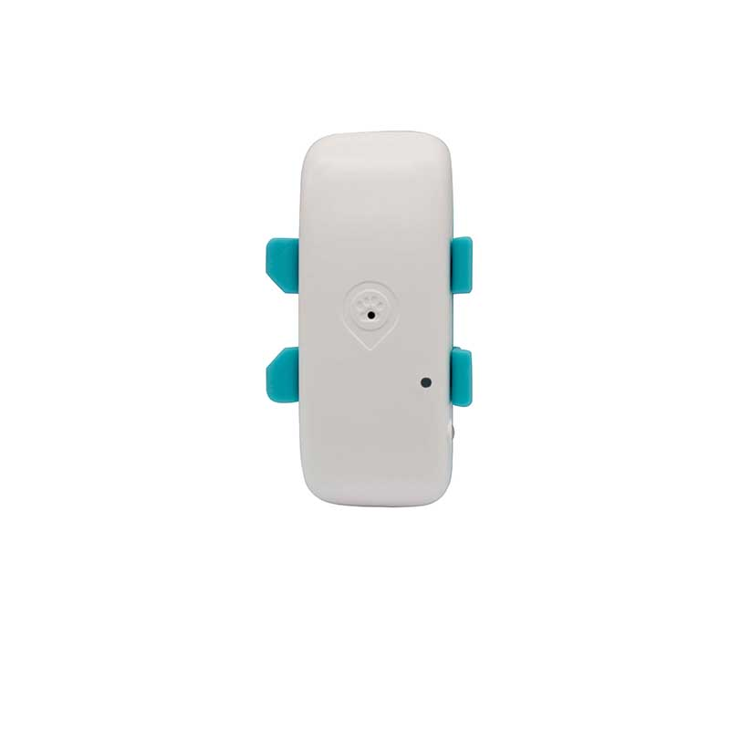

# Autoseeker - AT-3

The AT-3 4G GPS Pet Tracker is a compact, weatherproof GPS tracker designed to keep dogs and other pets safe with Plaspy-compatible real-time tracking. Built on 4G LTE Cat-1 connectivity and multi-band support, the AT-3 delivers reliable, low-power telemetry and location updates that integrate with Plaspy for live maps, alerts, and historical route playback.

Lightweight and rugged with an IP67-rated ABS shell and a 700mAh rechargeable battery, the AT-3 is optimized for collar or harness mounting. Its combination of real-time tracking, buzzer and LED retrieval aids, geo-fence alarms, and low-power alerts makes it a practical choice for pet owners, shelters, and animal-care operations using Plaspy-compatible tracking infrastructure.

## Key Highlights

- Plaspy compatible real-time tracking over 4G LTE Cat-1 for continuous, low-latency location and telemetry.
- Long standby battery life—up to seven days under normal conditions—with a 700mAh rechargeable polymer backup cell.
- IP67 water- and dust-resistant ABS enclosure for reliable outdoor use during walks, hiking, and light water exposure.
- Built-in buzzer and LED/light for quick pet retrieval and visual/sound location cues from the Plaspy app or web console.
- Geo-fence alarms and low-battery notifications configurable via Plaspy for proactive pet protection.
- Compact, lightweight form factor designed for collar or harness mounting with secure magnetic charging.
- History playback lets owners and caretakers review movement trails and events within Plaspy for better situational awareness.

## How It Works with Plaspy

The AT-3 transmits GNSS position fixes and status telemetry over cellular networks to be ingested by Plaspy’s platform. Once devices are registered in Plaspy, location points, battery level, and event flags \(such as geo-fence entry/exit and low battery\) appear in real time on maps and dashboards. Plaspy-compatible alerts, reporting, and historical playback allow pet owners and operators to monitor animals, receive notifications, and act quickly when needed.

- Real-time location and telemetry updates for live tracking and status monitoring in Plaspy.
- Geo-fence alarm events sent to Plaspy for instant notifications when a pet crosses predefined boundaries.
- Remote activation of the buzzer and LED via Plaspy interfaces to aid in retrieval of hidden or lost animals.
- History playback and route review for post-event analysis and training records.
- Low-battery alerts forwarded to Plaspy so caretakers can schedule recharges and avoid downtime.
- Designed for pet telemetry and location: does not include vehicle-specific ignition, immobilizer, or fuel monitoring interfaces.

## Technical Overview

| Connectivity | 4G LTE-FDD \(Cat-1\) with GSM fallback |
| --- | --- |
| Bands | LTE-FDD: B1/B2/B3/B4/B5/B7/B8/B28/B66; GSM: B2/B3/B5/B8 \(850/900/1800/1900 MHz\) |
| Power & Battery | Operating voltage DC 3.4V–4.5V; avg. working current 55mA @ 4V; standby 5mA; sleep 3mA. Backup battery: 700mAh \(3.7V\) polymer cell. Magnetic charging supported. |
| Interfaces | Built-in buzzer and LED/light function. \(External I/O such as ignition or immobilizer not applicable.\) |
| GNSS | ZKW AT6558D GPS chipset for positioning and route logging. |
| Bluetooth | Not specified |
| Remote Management | Compatible with smartphone apps and web platforms for live tracking, alerts, and history playback; integrates with Plaspy for centralized device management. |
| Form Factor | ABS plastic shell, IP67 rated. Dimensions: approx. 75.8 x 37.6 x 19 mm \(30 mm excluding mounting ears\). Weight: ~50 g. Designed for collar/harness mounting. |

## Use Cases

- Daily walks and outdoor adventures — real-time GPS tracker and buzzer/LED help locate pets on trails and in parks.
- Training and hunting dogs — history playback and live tracking via Plaspy support performance review and safety monitoring.
- Pet care businesses and shelters — manage multiple animals with Plaspy-compatible telemetry for location, status, and alerts.
- Veterinary field operations and rescues — compact, weatherproof device for tracking animals during transport and field searches.
- Free-roaming or off-leash monitoring — geo-fence alarms provide automatic notifications when pets leave safe zones.

## Why Choose This Tracker with Plaspy

Choosing the AT-3 as a Plaspy compatible GPS tracker gives pet owners and animal-care organizations a focused solution for dependable, low-power real-time tracking and telemetry. The multi-band 4G LTE Cat-1 radio ensures broad cellular coverage for live updates, while the IP67-rated ABS enclosure and magnetic charging simplify everyday use. Integration with Plaspy brings those location points and alerts into a single dashboard, enabling centralized monitoring, geofence management, and historical analysis—useful whether you manage one dog or a group across a facility. Designed expressly for animals, the AT-3 emphasizes retrieval features, battery efficiency, and rugged portability rather than vehicle-specific telemetry like ignition or fuel monitoring, making it a practical, reliable choice for pet-focused tracking on the Plaspy platform.

