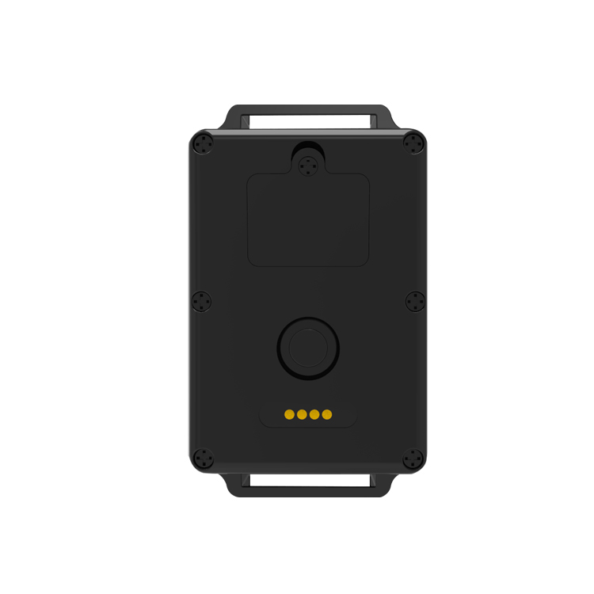

# Autoseeker - AT-4

The Autoseeker AT-4 is a purpose built 4G CAT 1 pet GPS tracker designed for reliable, long duration tracking of larger animals. It pairs a rugged IP67 rated ABS enclosure with a high capacity 3000mAh rechargeable battery and practical features such as geofence alarms, a searching light, audible buzzer, two way calling, and remote voice monitoring to support continuous outdoor use and straightforward owner interaction.

As a Plaspy compatible device, the AT-4 streams positioning and status updates to platforms that accept standard GPS GSM trackers, making it a good fit for users who want to track animals in real time using Plaspy. Its combination of extended standby life, outdoor durability, and owner facing features makes the device suitable for integration into Plaspy workflows for monitoring, alerts, and history review in open range and field environments.

## Key Highlights

- Built for outdoor use with IP67 rated ABS housing for dust and water resistance.
- High capacity 3000mAh rechargeable battery for extended standby periods between charges.
- 4G LTE FDD connectivity with GSM fallback to maintain broad cellular coverage for position updates.
- Owner interaction tools including two way calling and remote voice monitoring for direct contact.
- Night search aids with built in searching light and audible buzzer to locate animals in low visibility.
- Geofence alarms and history playback to support safety, recovery, and behavioral review.

## How It Works with Plaspy

When connected to Plaspy, the AT-4 delivers location and event information over its cellular link so owners and operators can view live positions, receive notifications, and review past routes. Plaspy ingests the device updates to provide map visualization, geofence alerts, and history playback alongside other devices managed on the platform.

- Live location updates and status messages visible on Plaspy maps and dashboards for real time oversight.
- Geofence alarm delivery to notify when an animal leaves or reenters predefined areas.
- Low battery notifications to help maintain device uptime and schedule recharges.
- History playback for route review and post event analysis within Plaspy reporting.
- Use of two way calling and remote voice monitoring for immediate audio contact when needed.

## Typical Use Cases

- Tracking large dogs during hunting, fieldwork, or extended outdoor activity where long standby life matters.
- Breeders and handlers monitoring multiple animals across large properties with geofence alerts.
- Locating and recovering animals at night using the searching light and audible buzzer.
- Remote monitoring and direct vocal contact to reassure or check on animals in the field.
- Route analysis and behavior review using history playback to inform training and management.

## Why Choose This Tracker with Plaspy

The AT-4 pairs practical animal tracking features with durability and extended battery life, making it a sensible choice for owners, breeders, and handlers who need dependable remote monitoring. When used with Plaspy, the device’s real time updates, geofence alerts, and history playback are presented in a unified interface that supports operational oversight and simpler incident response.

If you want to learn more about how Plaspy can incorporate the Autoseeker AT-4 into your tracking workflows, visit https://www.plaspy.com. Product specifications and availability can change over time, so verify current features and technical details on the manufacturer site https://autoseekergps.com/ before making procurement or deployment decisions.
