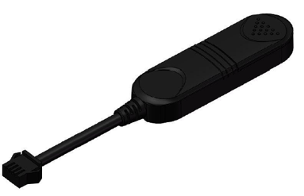

# Bofan - B4

The Bofan B4 is a basic 4G GPS vehicle tracker designed for straightforward vehicle monitoring at a reasonable cost. It offers essential tracking features in a compact, classic package and is positioned for both fleet and personal vehicle use. Core capabilities described by the manufacturer include geofence alerts, remote engine cut, engine operating time monitoring, SMS and GPRS tracking options, internal antennas, and a single ACC input and output for simple integrations.

Although Bofan promotes the B4 for use with its own platform, the B4 is also compatible with Plaspy, allowing users to integrate the device into Plaspy's fleet management environment. When connected to Plaspy, the device's core features can be used to add location visibility, alerting, and basic operational oversight alongside other devices managed in the same platform.

## Key Highlights

- Basic 4G GPS tracking suitable for cost conscious vehicle monitoring
- Geo-fence alerting to notify when a vehicle enters or leaves a preset area
- Remote engine cut capability for theft response and asset protection
- Engine running time monitoring to help track usage and optimize operations
- Options for tracking via SMS or live reporting by GPRS for flexible connectivity
- Designed to reduce GPRS reporting when the vehicle is static to save data costs
- Internal GSM and GPS antennas with one ACC input and one output for simple control

## How It Works with Plaspy

The Bofan B4 can be integrated into Plaspy to provide location data, alerts, and basic vehicle control signals alongside other fleet devices. Plaspy can ingest the B4's location updates and event notifications and present them in dashboards and reports that support everyday fleet operations.

- Real time location and historical route viewing within Plaspy dashboards
- Geofence creation and alert delivery through Plaspy when boundaries are crossed
- Remote engine cut commands coordinated via Plaspy where the device and account configuration allow
- Engine on time and usage reports available for operational insight and scheduling
- SMS fallback and GPRS reporting handled so Plaspy can show device activity even with varied connectivity
- Reduced reporting during static periods reflected in Plaspy to help control data costs

## Typical Use Cases

- Small to medium fleet tracking where cost effective visibility is required
- Personal vehicle monitoring for location awareness and geofence alerts
- Theft response workflows that use remote engine cut to limit loss
- Usage tracking to monitor engine run time for scheduling maintenance or optimizing operations
- Situations where SMS fallback or reduced reporting in static mode helps lower connectivity expenses

## Why Choose This Tracker with Plaspy

The Bofan B4 is a practical option for organizations seeking a straightforward, budget conscious 4G tracker that covers essential fleet monitoring needs. Its geofence alerts, remote engine cut, and engine run time reporting align with common operational requirements, and combining the B4 with Plaspy brings those signals into a broader fleet management context. Using Plaspy, teams can centralize visibility, configure alert workflows, and include the B4 in mixed device deployments without needing specialized tooling.

Because product descriptions and feature claims vary, the B4 is best considered when the stated functions meet your operational needs and when you confirm behavior in your environment. To learn more about Plaspy and how it can manage devices like the Bofan B4, visit https://www.plaspy.com. Please note that product specifications availability and manufacturer details can change over time so verify current specifications on the manufacturer's official site https://www.bofancloud.com/ before purchase or deployment.
