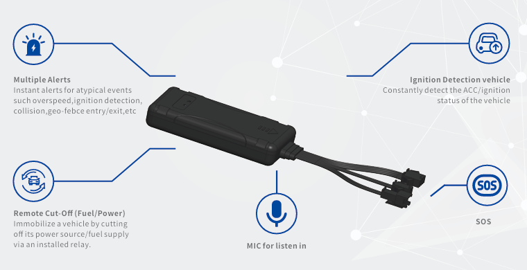

# Bofan - B5

The GPS Vehicle Tracker B5 is a compact, vehicle-mounted GPS tracker designed for reliable, 24/7 fleet monitoring and security. Plaspy compatible out of the box, the B5 delivers real-time tracking and telemetry to your Plaspy dashboard, enabling rapid response to theft, operational inefficiencies, and driver-safety events.

Built for fleet management and anti-theft applications, the B5 combines continuous GNSS positioning, configurable geo-fence alerts, remote engine control and engine runtime analytics with intelligent GPRS data-saving modes. Its durable design, internal high‑gain GNSS and GSM antennas, and built-in accelerometer make the B5 a practical choice for commercial and private vehicle deployments that need dependable location, event and telemetry reporting through Plaspy.

## Key Highlights

- Plaspy compatible GPS tracker for secure, real-time tracking and centralized fleet management.
- Remote engine control \(immobilizer-capable\) and one-touch SOS for rapid anti-theft response and emergencies.
- Configurable geo-fence, overspeed, towing, crash, jamming and unplug detection to protect assets and drivers.
- Accelerometer-based movement detection and trip logging for driver behavior and maintenance planning.
- GPRS data-saving modes and configurable GPRS commands to reduce cellular costs while maintaining telemetry.
- Internal high-gain GNSS and GSM antennas plus 8 MB internal flash for offline logging and reliable reception.
- Four digital inputs and one digital output to connect ignition sensing, alarms or external sensors for richer telemetry.

## How It Works with Plaspy

The B5 streams location and event data to Plaspy over GPRS/GSM, enabling live maps, alerting, and historical reports. Plaspy ingests the B5’s telemetry and scenario-driven alerts so fleet managers can see position, engine runtime and critical events in a single pane. Remote commands from Plaspy—sent via GPRS—allow configuration changes and remote engine control where deployed.

- Real-time location and telemetry updates delivered to Plaspy for live tracking and replay.
- Ignition and engine runtime analytics via digital inputs; useful for maintenance scheduling and utilization reports.
- Remote immobilizer/engine control support through the device’s digital output for anti-theft actions.
- Trip logging and 8 MB internal flash for temporary offline storage and later upload when connectivity resumes.
- Scenario alerts \(overspeeding, jamming, unplug, towing, crash\) map to Plaspy alarms and workflows for rapid response.
- One-touch SOS and remote voice monitoring \(external MIC\) provide situational awareness during emergencies.

## Technical Overview

| Connectivity | GSM/GPRS with Micro‑SIM slot; intelligent GPRS data‑saving modes and configurable GPRS commands |
| --- | --- |
| Bands | GSM/GPRS \(specific cellular bands depend on model/region and carrier provisioning\) |
| Power & Battery | Vehicle-powered with sleep modes \(Online / Sleep / Normal\); battery status alerts and power loss notifications |
| Interfaces | Micro‑SIM slot; 4 digital inputs; 1 digital output \(for immobilizer/remote engine control or alarm\); external microphone input; one‑touch SOS |
| GNSS | Internal high‑gain GNSS antenna for robust satellite reception; time synchronization via GNSS and server |
| Sensors | Built‑in accelerometer for movement, towing and crash detection |
| Memory | 8 MB internal flash for local trip logging and event buffering during connectivity loss |
| Bluetooth | Not specified / not included |
| Remote Management | Configuration via GPRS commands; server-side integration with Plaspy for alerts, reporting and remote control |
| Form Factor | Compact vehicle-mounted unit with two status LEDs and internal high‑gain GSM/GNSS antennas |

## Use Cases

- Fleet anti-theft and immobilization — detect unauthorized movement, trigger alerts, and remotely disable the engine output when required.
- Driver behavior monitoring and maintenance planning — engine runtime analytics and trip logging feed Plaspy reports for preventive service scheduling.
- Emergency response and occupant safety — one-touch SOS plus remote voice monitoring allow rapid incident verification and assistance.
- Asset protection and tamper detection — unplug detection, jamming alerts and crash/towing detection protect vehicles and trailers.
- Operational optimization — use geo-fence and overspeed events combined with Plaspy reporting to improve routing, reduce fuel waste and enforce policies.

## Why Choose This Tracker with Plaspy

The B5 GPS tracker pairs practical hardware design with Plaspy’s fleet management capabilities to deliver a balanced solution for fleets focused on reliability, security and cost control. Its internal high‑gain antennas and rigorous quality-control testing \(including vibration, temperature and power‑jitter tests\) mean fewer field failures and more consistent telemetry. Intelligent GPRS modes and offline flash storage lower cellular costs while preserving critical trip and event data for Plaspy’s reporting. Combined with digital inputs for ignition sensing and a digital output for immobilization, the B5 lets you enforce anti-theft measures and capture engine runtime for maintenance scheduling.

For operations that require real-time tracking, telemetry, anti-theft controls and robust event detection, the B5 offers a Plaspy compatible platform that integrates into existing fleet workflows. Whether your priority is reducing downtime, protecting assets, or improving driver safety, deploying the B5 with Plaspy gives you centralized visibility, actionable alerts and remote control capabilities to keep your vehicles secure and operations efficient.

