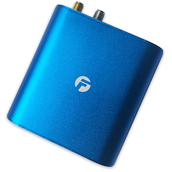

# Bofan - PT502

The PT502 is a 4G GPS tracker designed for professional fleet management and vehicle security. Built for vehicle environments, the PT502 offers real time tracking, multi camera support, driver identification via RFID, ultrasonic fuel sensing and remote immobilizer controls. Its alarm and input/output capabilities make it suitable for fleets that need reliable position data and event driven monitoring.

As a device listed as compatible with Plaspy, the PT502 can forward location, sensor and alarm data into the Plaspy platform for consolidated fleet oversight. Integrating this tracker with Plaspy allows operators to view live positions, receive alerts and combine telemetry from cameras and fuel sensors into the platform's monitoring and reporting workflows.

## Key Highlights

- Plaspy compatible 4G GPS tracker for real time fleet visibility
- Support for up to four external cameras for event photo capture
- RFID driver identification for driver to vehicle association and reporting
- Ultrasonic fuel sensing compatibility to support fuel level monitoring
- Remote engine shutdown and speed limitation using external relays
- Flexible alarm suite including SOS, geo fence, speed and power cut alerts

## How It Works with Plaspy

When connected to Plaspy the PT502 delivers position and event data that Plaspy aggregates into maps, alerts and historical reports. The device's peripherals and alarms enhance situational awareness and let operators act on visual evidence, fuel discrepancies or security events within Plaspy.

- Real time location and telemetry updates delivered to Plaspy via the device connectivity options
- ACC or ignition status reporting for accurate trip segmentation and engine on off tracking
- Ultrasonic fuel sensor data used in Plaspy reports and for fuel discrepancy alerts
- Remote immobilizer and speed control executed through Plaspy command functions using device outputs
- Automatic camera photos and event images sent with alarm events for visual verification

## Typical Use Cases

- Fleet anti theft and immobilization workflows with remote disable controls
- Driver identification and behaviour monitoring using RFID plus Plaspy reporting
- Fuel management programs that use ultrasonic sensing to detect discrepancies
- Event driven photo capture for incident verification and evidence collection
- Maintenance and compliance tracking with mileage logging and reminders

## Why Choose This Tracker with Plaspy

The PT502 pairs practical vehicle focused capabilities with Plaspy's platform to give fleet operators a clearer operational picture. Its support for multiple cameras, RFID driver ID and fuel sensor inputs extends the visibility available in Plaspy, helping teams investigate incidents, reconcile fuel usage and maintain accurate trip records. Remote immobilizer and speed limiting functions offer a firm toolset for theft response and policy enforcement when managed through Plaspy.

For fleets that require a rugged tracker with a broad set of peripheral options, the PT502 is a versatile choice to consider alongside Plaspy. Its combination of real time tracking, camera evidence and sensor reporting helps streamline day to day fleet monitoring without introducing unnecessary complexity.

Learn more about how Plaspy supports compatible devices and fleet workflows by visiting https://www.plaspy.com. Product specifications and availability can change over time, so please verify current technical details and peripheral compatibility with the manufacturer at https://www.bofancloud.com/.
