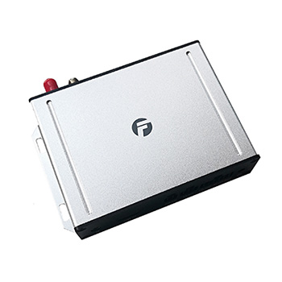

# Bofan - PT621

# PT621 4G Vehicle GPS Tracker

The PT621 is a rugged 4G vehicle GPS tracker engineered for fleet management, vehicle security, and specialized monitoring applications. Plaspy compatible out of the gate, the PT621 delivers reliable real-time tracking and configurable telemetry so fleets, logistics operators, and service managers can maintain visibility and control across vehicles and assets.

The unit supports multi-channel connectivity \(4G/GPRS and SMS\) and integrates with FMS platforms to deliver location, sensor data, alarms, and event-driven reports into Plaspy. With remote engine cut via external relay, two-way voice capability, automated photo capture, and extensive sensor interfaces, the PT621 is designed to reduce theft, optimize vehicle utilization, and surface actionable telematics for better operational decisions.

## Key Highlights

- Plaspy compatible real-time tracking over 4G/GPRS and SMS for continuous fleet visibility.
- Remote engine cut via external relay for effective anti-theft and immobilizer control.
- Support for up to four external cameras to capture automated photos tied to events.
- Driver identification via external RFID sets to link drivers to trips and behavior data.
- Comprehensive alarm set \(SOS, geo-fence, speed, fuel/temperature, ACC, antenna cut, and more\) with SMS/call/email notifications.
- Flexible inputs/outputs and sensor support for fuel monitoring, temperature, door status, and other vehicle telemetry.
- On-board features for safety and compliance: speed limiting, buzzer reminders, LED message display, and driving behavior analysis.

## How It Works with Plaspy

Integrating the PT621 with Plaspy brings vehicle position, event data, and sensor telemetry into a single operational console. The device reports using 4G/GPRS and can fall back to SMS for essential alerts. Plaspy ingests the device’s position updates, alarms, and sensor readings and presents them as live maps, alerts, and historical reports for fleet managers.

- Real-time location and telemetry updates delivered to Plaspy via 4G/GPRS \(and SMS for critical notifications\).
- Ignition and door status reporting \(ACC on/off\), plus configurable alarm triggers such as geo-fence and speed violations.
- Fuel monitoring and temperature sensor integration for fuel-theft prevention and cold-chain logistics alerts.
- Remote immobilizer capability through external relay for safe engine cut when needed.
- Event-triggered photo capture from up to four external cameras; images can be linked to Plaspy events where platform support exists.

## Technical Overview

| Connectivity | 4G / GPRS; SMS; integration with FMS platforms |
| --- | --- |
| Bands | Not specified \(consult manufacturer or product datasheet for regional band support\) |
| Power & Battery | Vehicle-powered with low-battery alarm reported; backup battery details not specified |
| Interfaces | 2 digital inputs \(one negative, one positive trigger\), 2 outputs; external relay for engine cut; external microphone and speaker; up to 4 external cameras; RFID reader interface; sensor inputs for fuel, temperature, door status; buzzer and LED screen message output |
| GNSS | GPS tracking \(accuracy not specified\) |
| Bluetooth | Not specified \(device supports wired external peripherals; consult Plaspy options for Bluetooth sensor aggregation\) |
| Remote Management | FMS/platform integration for remote reporting and configurable alarms; FOTA or web management not specified |
| Form Factor | Vehicle-mounted tracker designed for fleet and asset telematics with external peripheral connections |

## Use Cases

- Fleet management: real-time tracking, driver identification, and driving behavior analysis to improve safety and utilization.
- Cold-chain logistics: temperature sensor integration and high-temperature alarms for refrigerated transport monitoring.
- Anti-theft and immobilization: remote engine cut, GPS antenna cut detection, and SOS alarms to protect high-value vehicles.
- Fuel monitoring and prevention: support for ultrasonic and wired fuel sensors to detect discrepancies and deter fuel theft.
- On-site enforcement and safety: speed limiting, over-speed buzzer reminders, LED screen messages, and automated photo capture for incident documentation.

## Why Choose This Tracker with Plaspy

The PT621 combines proven vehicle telematics features with flexible peripheral support to deliver a complete Plaspy-compatible solution. Its real-time tracking and rich alarm set provide timely anti-theft and operational alerts, while inputs for fuel, temperature, and door sensors enable detailed telemetry for logistics and compliance. Driver ID, two-way voice, and automated camera capture extend accountability and incident evidence collection. For fleet operators seeking reliable monitoring, remote immobilization, and actionable data within Plaspy, the PT621 offers an integration-ready platform that balances security, telemetry, and scalability.

