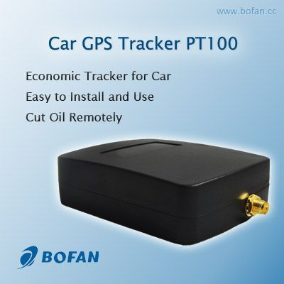

# Bofan - PT-100

The Bofan PT-100 is a low-cost GPS car tracker that offers reliable tracking capabilities for vehicles. With its compact design and advanced features, it is an ideal choice for individuals and businesses looking to enhance the security and management of their vehicles.

One of the standout features of the PT-100 is its ability to track vehicles either via SMS or live tracking through GPRS. This allows users to monitor the location of their vehicles in real-time, ensuring that they are always aware of their whereabouts. Additionally, the tracker supports tracking by time interval, allowing users to set specific time intervals at which the tracker will provide updates on the vehicle's location.

The PT-100 also boasts a position logging capacity of up to 3,000+ waypoints, ensuring that users have access to detailed historical data about their vehicle's movements. This can be particularly useful for fleet management purposes or for keeping track of personal vehicles. The tracker also includes an SOS button, which can be used in emergency situations to send an alert to designated contacts.

Other notable features of the PT-100 include geo-fence alerts, low power alerts, cut power alerts, and over speed alerts. These features help users to set up customized notifications and alerts based on specific parameters, ensuring that they are promptly notified of any unusual or unauthorized activities involving their vehicles. The tracker also offers the option for engine cut functionality, allowing users to remotely disable the vehicle's engine if necessary.

In terms of connectivity, the PT-100 supports both SMS and GPRS communication, providing users with multiple options for accessing the tracker's data. It also includes an internal GSM antenna for improved signal reception. The tracker is equipped with 2 digital inputs, 1 negative and 1 positive triggering, as well as 1 output, allowing for additional customization and integration with other devices or systems.

Overall, the Bofan PT-100 is a cost-effective GPS car tracker that offers a range of features to enhance vehicle tracking and management. Whether you need to monitor a single vehicle or an entire fleet, the PT-100 provides the necessary tools to ensure the safety and security of your vehicles.

