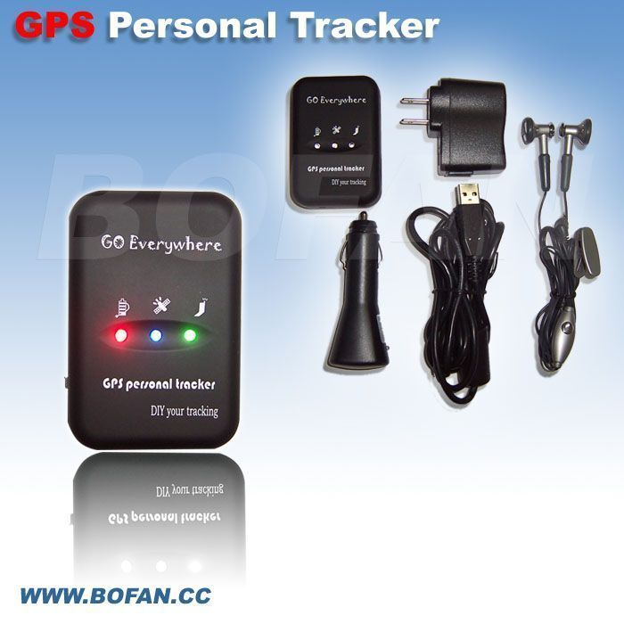

# Bofan - PT-30

The Bofan PT-30 is a compact and reliable personal GPS tracker designed for discreet location monitoring of people and portable assets. It reports position information via SMS or GPRS and combines satellite positioning with cellular connectivity to maintain reliable updates even in challenging environments such as urban canyons. The unit is small and unobtrusive, with features aimed at everyday tracking and safety, including SOS alerts, preset emergency contacts, geo fence boundaries, and two way communication for urgent situations.

As a Plaspy compatible device, the PT-30 can be integrated into Plaspy's tracking platform to add real time visibility and centralized oversight. Its ability to send location and alert messages over SMS or GPRS makes it straightforward to route updates into Plaspy for map display, history logging, and event notifications. This compatibility allows organizations and individuals to combine the PT-30's compact hardware with Plaspy's monitoring, reporting, and alerting tools for practical tracking workflows.

## Key Highlights

- Compact form factor suitable for discreet personal or asset tracking
- Location reporting via SMS or GPRS for flexible connectivity options
- High sensitivity GPS performance for improved position fixes in weak signal areas
- SOS button and two way communication for emergency alerts and contact
- Configurable geo fence functionality with boundary crossing alerts
- Supports multiple GSM frequency bands for broad cellular compatibility

## How It Works with Plaspy

When used with Plaspy, the PT-30's location updates and alert messages can be captured and presented within a single monitoring environment, enabling live visibility and historical review. Plaspy can receive the device's messages and translate them into map positions, alerts, and reports for operational use.

- Real time map display of position updates sent by the tracker
- Geo fence monitoring and automated alerts when boundaries are crossed
- SOS and emergency messages surfaced to operators and sent to preset contacts
- Historical location logging for reporting and playback of device movement
- Grouping and organizational views to manage multiple PT-30 units within a fleet or program

## Typical Use Cases

- Personal safety and lone worker monitoring with emergency alert capability
- Protection and tracking of portable high value assets during transit
- Discreet short term tracking for rental equipment or loaned devices
- Location oversight for field staff and small teams operating in urban areas
- On demand tracking for check ins or scheduled position reporting

## Why Choose This Tracker with Plaspy

The PT-30 pairs a small, discreet hardware profile with dependable location reporting methods, which makes it a practical choice for organizations that need unobtrusive tracking paired with centralized monitoring. Its SOS function and geo fence options provide basic safety and alerting features that integrate well with Plaspy's notification and response tools.

Plaspy adds value by turning the PT-30's SMS and GPRS reports into actionable information: mapped positions, event alerts, and historical reports that help teams maintain situational awareness and manage responses. For deployments that prioritize compact devices and straightforward connectivity, the PT-30 and Plaspy together offer a balanced solution for tracking and oversight.

To learn more about Plaspy and how it can work with compatible devices, visit the Plaspy main website https://www.plaspy.com. Product specifications and manufacturer details can change over time, so please verify the latest technical specifications and availability with the manufacturer at https://www.bofancloud.com/.
