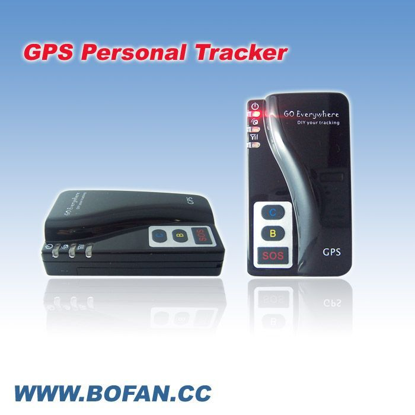

# Bofan - PT-60

The Bofan PT-60 is a compact personal GPS/GSM/GPRS tracker designed for locating and protecting people and assets. It provides real time location updates and includes practical features such as geo fence alerts, an SOS button for emergency notifications, movement and speed alarms, and a low battery warning. The unit also supports two way voice communication and a short range listen in capability, making it suitable for a variety of personal safety and asset monitoring scenarios.

As a Plaspy compatible device, the PT-60 can feed location and alert information into Plaspy for centralized visibility and management. Plaspy users can view device positions, receive notifications generated by the PT-60, and include events from the tracker in reporting and operational workflows. That makes the PT-60 a sensible choice for organizations and individuals who want a compact tracker with standard safety and alerting features integrated into a fleet or monitoring platform.

## Key Highlights

- Compact form factor suitable for personal carry or discreet placement with straightforward location reporting
- Real time locating and tracking to support live monitoring and quick situational awareness
- Geo fence function to define safe or restricted areas and trigger alerts on boundary breaches
- SOS button that sends immediate help alerts together with location details to authorized contacts
- Movement alarm excess speed alarm and low battery alerts to signal unusual activity or maintenance needs
- Two way voice communication plus a short range listen in capability for direct contact or situational assessment

## How It Works with Plaspy

When paired with Plaspy the PT-60 streams its location and alert events into a central platform so fleet managers operators and caregivers can monitor devices alongside other assets. Plaspy consolidates the tracker's real time positions and alarms into the same interface used for broader operational oversight.

- Display live location and recent position history for each PT-60 within Plaspy maps and device lists
- Receive and route geo fence SOS movement speed and low battery alerts through Plaspy notification channels
- Correlate PT-60 events with other fleet activity for incident review and operational reporting
- Use Plaspy reporting tools to export device activity logs and summarize alerts for audits or performance review
- Group PT-60 devices for role based monitoring and assign ownership for faster response

## Typical Use Cases

- Personal safety monitoring for children elderly or vulnerable individuals with SOS and geo fence alerts
- Asset protection for portable equipment and valuables that require discreet tracking and movement notifications
- Small vehicle or light fleet tracking where compact devices are preferred for quick deployment
- Personnel monitoring for remote workers or lone employees where voice contact and alerts are useful
- Pet tracking or short range monitoring where compact size and basic alerting features are adequate

## Why Choose This Tracker with Plaspy

The PT-60 combines a succinct feature set focused on location reporting and safety alerts with a compact hardware profile, making it adaptable to many light duty tracking needs. Integrated with Plaspy the tracker becomes part of a larger monitoring and reporting ecosystem, enabling teams to centralize alerts and position data alongside other devices and workflows.

For organizations seeking a straightforward personal or asset tracker that can connect into a fleet management platform, the PT-60 paired with Plaspy delivers practical visibility and alerting without unnecessary complexity. Where a compact device with SOS geo fence and basic alarm functions fits the requirement, this combination is worth considering.

To learn more about Plaspy and how it can consolidate devices like the Bofan PT-60 into a unified tracking platform visit https://www.plaspy.com. Product specifications availability and manufacturer details can change over time so please verify current technical information and feature lists on the official manufacturer website https://www.bofancloud.com/.
