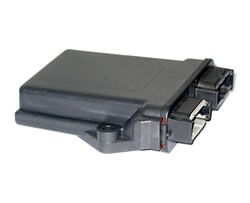

# Box - Box Solo

The BOX Solo is a reliable and efficient trailer tracking unit designed to continuously log the position of trailers. Equipped with high sensitivity GPS receivers and quad band GSM/GPRS technology, this tracker ensures accurate and real-time data transmission to the BOX data collection web site. Approved by the Vehicle Certification Agency \(VCA\) and compliant with EMC/FCC/UL standards, the BOX Solo is suitable for use in the US markets with the 850 & 1900MHz frequency bands for GSM/GPRS.

Installation of the BOX Solo is quick and easy, requiring only three wires to be attached to the trailer's positive, negative, and ignition feed. These wires are typically found within the Suzzie connector. With its compact design and user-friendly interface, this tracker is a convenient solution for track & trace, vehicle recovery, and fleet management applications.

Key Features:

- Full quadband GSM band for reliable communication
- No voice capability
- Back-up battery for uninterrupted tracking
- Internal memory for data storage
- Communication methods include GSM, GPRS, TCP, and UDP
- Positioning options based on time, distance, and angle change
- Sleep mode for power saving
- Two digital inputs for versatile functionality
- One analogue input for additional sensor integration
- GPS and GSM antennas for optimal signal reception
- Durable plastic casing for long-lasting performance
- Extra connectivity options with fix antennas
- European-made for quality assurance

