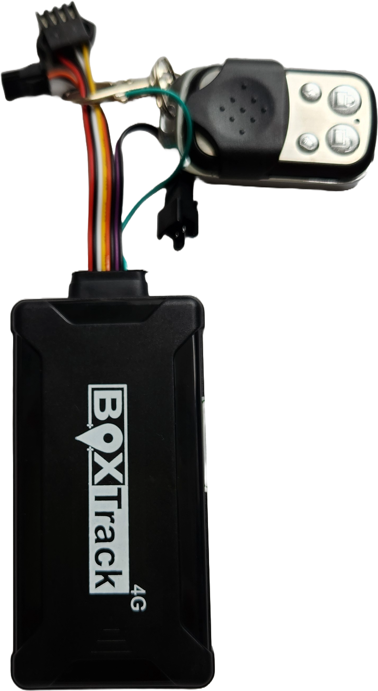

# BoxTrack - Control

The **Boxtrack Anti-Theft Control** is an advanced GPS tracker designed to ensure real-time monitoring and security for vehicles. With a location accuracy of less than 5 meters, this device allows users to know the exact position of their vehicle at all times. Thanks to its **engine cut-off function**, it can be controlled remotely via SMS, a mobile app, or a web platform, providing an extra layer of security in case of theft or unauthorized use.

Additionally, the **Boxtrack Anti-Theft Control** includes key features such as an **SOS panic button**, **live audio monitoring** via an external microphone, and a **G-sensor** that detects impacts and reckless driving. Its **4G/2G/GPRS** connectivity ensures stable communication under various conditions. It also has an **internal memory** capable of storing up to **2,000 reports**, ensuring no data is lost even if the signal is temporarily interrupted. With a **200mAh backup battery**, it provides up to **4 hours of autonomy**, ensuring continuous tracking in critical situations.

#### **Technical Specifications**

| Feature | Description |
| --- | --- |
| **GPS Accuracy** | &lt;5m |
| **Connectivity** | 4G/2G/GPRS |
| **Engine Cut-Off** | Remote control via SMS, App, or Web |
| **SOS Button** | Yes |
| **Live Audio** | External microphone |
| **G-Sensor** | Detects impacts and reckless driving |
| **Remote Control** | Panic button, power cut, and siren activation |
| **Operating Voltage** | 9V - 36V |
| **Internal Battery** | 200mAh \(up to 4 hours of backup\) |
| **Internal Memory** | 2,000 reports |
| **Siren Port** | Yes |
| **Ignition Sensor** | Detects vehicle startup |

#### **Key Features**

- **Real-time tracking** with high accuracy.
- **Remote engine shutdown** to prevent theft.
- **Impact and harsh driving alerts** via G-Sensor.
- **SOS panic button** for emergency situations.
- **Live audio monitoring** via external microphone.
- **Stable connectivity** through 4G and 2G networks.

