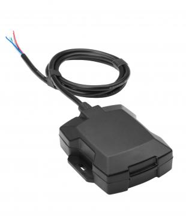

# CalmAmp - LMU-1100

The CalmAmp LMU-1100 is a reliable and cost-effective vehicle tracking device designed for easy installation in recreational vehicles and assets that are exposed to outdoor conditions. It is an ideal solution for monitoring assets and recovering stolen motorcycles, snowmobiles, and other outdoor recreational vehicles. With its small size and superior GPS performance, the LMU-1100 offers accurate tracking capabilities and comes equipped with a 1000 mAh backup battery and 2 inputs/1 output \(I/O\).

One of the standout features of the LMU-1100 is its flexibility. It utilizes CalAmp's advanced on-board alert engine, PEG \(Programmable Event Generator\), which allows users to monitor external conditions and set up custom rules based on specific events or thresholds. This ensures that the device can be tailored to meet the unique requirements of different applications. Whether it's monitoring time, date, motion, location, geo-zones, or input events, the LMU-1100 can be programmed to respond instantaneously to predefined conditions.

In addition to its flexibility, the LMU-1100 offers over-the-air serviceability through CalAmp's management and maintenance system, PULS \(Programming, Updates, and Logistics System\). This allows for easy configuration of parameters, PEG rules, and firmware updates without the need for manual intervention. With PULS, fleet managers can remotely monitor the health status of the LMU-1100 units across their entire fleet, enabling them to identify and address any issues before they become costly problems.

