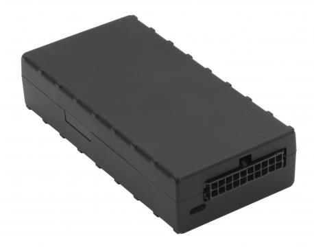

# CalmAmp - LMU-1200

The CalmAmp LMU-1200 is a compact vehicle tracking device designed for reliable location monitoring in automobiles. It combines advanced GPS positioning, a built in 1000 mAh backup battery for continued operation during power loss, and a 3-axis accelerometer for motion and tilt sensing. The unit includes four inputs and outputs and internal antennas for cellular and GPS reception, making it appropriate for a range of mobile vehicle installations across 12 and 24 volt platforms.

As a Plaspy compatible device, the LMU-1200 can provide the core location and event data that fleet and asset managers need inside the Plaspy platform. Its motion sensing, configurable event generator, and remote configuration features make it a practical choice for organizations that want to centralize vehicle visibility, alerts, and reporting within Plaspy while retaining flexibility to tailor behavior to operational needs.

## Key Highlights

- Reliable internal 1000 mAh backup battery to maintain tracking during power interruptions
- Integrated GPS with strong internal antennas for consistent location reporting
- 3-axis accelerometer for motion and tilt detection to support event based tracking
- Four inputs and outputs for flexible external signal monitoring
- Compact form factor suitable for discreet installation in many vehicle types
- Programmable Event Generator for custom event rules and thresholds
- Support for remote configuration and updates through the manufacturer system

## How It Works with Plaspy

When paired with Plaspy, the LMU-1200 supplies location and event information that the platform uses to improve operational oversight and fleet safety. Plaspy can ingest the device data and present it alongside other fleet telemetry to help teams monitor assets in real time and analyze historical activity.

- Live and historical location tracking to visualize vehicle routes and stops
- Motion and tilt events surfaced as alerts to indicate driving behavior or potential incidents
- Input and output status shown in Plaspy dashboards for monitoring external conditions
- Event based notifications and rule driven alerts to inform operations teams
- Reporting and exportable histories for fleet analysis and operational review

## Typical Use Cases

- Fleet management for route oversight, dispatch, and utilization monitoring
- Automotive insurance applications for event based monitoring and activity logs
- Stolen vehicle recovery by maintaining continuous location data and alerts
- Vehicle finance and repossession workflows that require reliable tracking
- Auto rental and shared vehicle programs for asset control and return monitoring

## Why Choose This Tracker with Plaspy

The LMU-1200 offers a balanced combination of compact design, persistent tracking capability, and configurable event logic that aligns well with Plaspy use cases. Its backup power and motion sensing provide resilience and actionable events that complement Plaspy dashboards and alerting, helping teams maintain visibility even when a vehicle loses main power.

For organizations evaluating hardware for use with Plaspy, the LMU-1200 is a practical option when you need a proven vehicle tracker with flexible I O and programmable event support. Pairing the LMU-1200 with Plaspy allows businesses to centralize monitoring, streamline alerts, and build reporting workflows without overcomplicating device management.

Learn more about how Plaspy can work with compatible trackers like the LMU-1200 by visiting https://www.plaspy.com. Product specifications, availability, and manufacturer features can change over time, so please verify current details on the manufacturer site http://www.calamp.com/ for the most up to date information.
