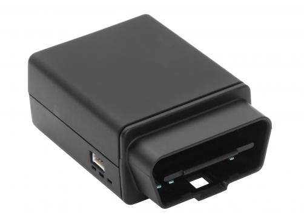

# CalmAmp - LMU-2000

The CalmAmp LMU-2000 is a versatile and cost-effective vehicle tracking device that offers a wide range of features for easy and reliable installation in automobiles. It is an ideal solution for various applications such as automotive insurance, driver behavior management, auto rental, and fleet management. 

One of the standout features of the LMU-2000 is its small size and superior GPS design, which allows for accurate tracking of vehicle speed and location. It also features an OBD-II interface, which enables it to detect hard braking, cornering, and acceleration. Additionally, the device is equipped with a 3-axis accelerometer, providing comprehensive fleet management capabilities. 

Installation of the LMU-2000 is quick and hassle-free, thanks to its superior internal antennas for both cellular and GPS, as well as its OBD-II connector. This eliminates the need for professional installation, making it a cost-effective choice. The device utilizes enhanced SMS or UDP messaging to transport messages across the cellular network, ensuring a reliable communication link between the device and your application servers. 

The LMU-2000 also offers flexibility through CalAmp's advanced on-board alert engine, PEG \(Programmable Event Generator\). This feature allows you to monitor external conditions and set up custom rules based on time, date, motion, location, geo-zone, input, and other event combinations. Whether it's monitoring driver behavior or tracking vehicle usage, the LMU-2000 can be tailored to meet your specific application requirements. 

Furthermore, the LMU-2000 benefits from over-the-air serviceability through CalAmp's management and maintenance system, PULS \(Programming, Updates, and Logistics System\). This allows for easy configuration, parameter updates, and firmware upgrades without the need for manual intervention. It also enables you to monitor the health status of the device across your fleet, helping you identify and address any issues before they become costly problems. 

With its comprehensive features, easy installation, and flexibility, the CalmAmp LMU-2000 is an excellent choice for anyone in need of a reliable and cost-effective vehicle tracking solution.

