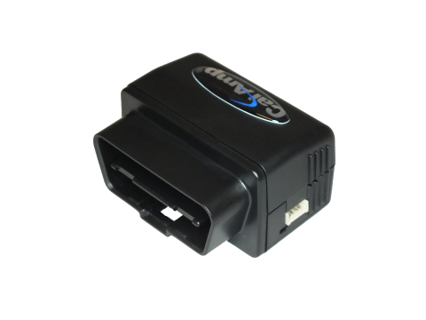

# CalmAmp - LMU-2010

The CalmAmp LMU-2010 is a versatile and cost-effective vehicle tracking device designed for easy installation in automobiles. It is equipped with a range of features that make it ideal for applications such as automotive insurance, driver behavior management, auto rental, and fleet management. With its compact size and superior GPS design, the LMU-2010 can accurately track vehicle speed and location. It also features a built-in OBD-II interface and a 3-axis accelerometer, allowing it to detect hard braking, cornering, and acceleration.

One of the standout features of the LMU-2010 is its Bluetooth low energy communication capability. This allows the device to establish a connection with the driver's smartphone, eliminating the need for a separate data account. The smartphone acts as a bridge, sending data over the cellular network to the application server. This not only reduces the cost of ownership but also makes installation quick, easy, and inexpensive.

The LMU-2010 also incorporates CalAmp's advanced on-board alert engine, PEG™ \(Programmable Event Generator\). This engine allows the device to monitor external conditions and respond to pre-defined threshold conditions. This means that you can set up custom rules based on time, date, motion, location, geo-zone, input, and other event combinations. The device can be programmed before shipment, at your facility, or even over-the-air once it has been deployed.

In addition to its impressive features, the LMU-2010 leverages CalAmp's PULS™ \(Programming, Updates, and Logistics System\) for over-the-air configuration and automatic post-installation upgrades. This system allows you to remotely manage and maintain the device, ensuring that it is always up to date and functioning optimally. It also provides valuable insights into the health status of your fleet, allowing you to identify and address any issues before they become costly problems.

### Key Features:

- Economical and full-featured vehicle tracking device
- Bluetooth low energy communication for smartphone connectivity
- Superior GPS design for accurate tracking of speed and location
- OBD-II interface and 3-axis accelerometer for advanced monitoring
- Programmable Event Generator for custom rule-based alerts
- PULS™ system for over-the-air configuration and upgrades

