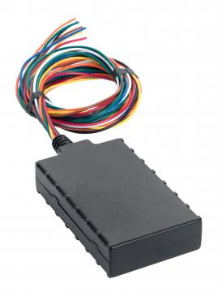

# CalmAmp - LMU-2100

The CalmAmp LMU-2100 is an insurance oriented vehicle tracking unit designed to deliver reliable location and event data for fleets and usage based insurance programs. Marketed as a robust and affordable device, the LMU-2100 includes a 3 axis accelerometer to detect driver behavior and vehicle impacts, a programmable on board event engine for custom rules, and wireless communication options to maintain continuous data flow for operational monitoring.

As a Plaspy compatible device, the LMU-2100 can feed location and event information into fleet dashboards and reporting workflows. Its event oriented design and over the air serviceability make it a practical choice for operators who want device level intelligence combined with Plaspy visibility, alerting, and analytics for fleet oversight and insurance use cases.

## Key Highlights

- Designed for insurance and fleet telematics with emphasis on driver behavior and impact detection
- Built in 3 axis accelerometer for detecting hard braking, aggressive acceleration, and impacts
- On board programmable event engine (PEG) allows custom, exception based rules at the device level
- Over the air serviceability through PULS for configuration and updates without manual intervention
- Multi network wireless communication to support continuous data delivery for fleet operations
- Positioned as a robust and cost effective option for large scale deployments

## How It Works with Plaspy

When connected to Plaspy the LMU-2100 supplies location points and event messages that Plaspy can display, aggregate, and act upon. Plaspy ingests the device data to provide operational oversight, reporting, and configurable alerts that complement the unit's on board rules.

- Real time location visibility and historical tracking for fleet monitoring and route analysis
- Ingested accelerometer events enable driver behavior insights and event based alerts in Plaspy
- Event and exception messages from the device can be mapped to Plaspy alerts for immediate notification
- Device reported status and configuration fields can be surfaced in Plaspy for operational management
- Plaspy reporting and dashboards can combine LMU-2100 telemetry with other fleet data for analytics

## Typical Use Cases

- Usage based insurance programs that require driver behavior and impact records
- Fleet safety monitoring to identify risky driving and reduce claims exposure
- Accident and impact detection for claims support and incident investigation
- Rental or shared vehicle monitoring where remote configuration and updates are useful
- Operational oversight for commercial fleets needing automated exception reporting

## Why Choose This Tracker with Plaspy

The LMU-2100 is a practical choice for organizations that need insurance oriented telematics paired with a flexible platform. Its accelerometer driven event reporting and programmable event engine let teams capture the kinds of exceptions and behaviors that matter for safety and underwriting, while over the air management reduces the operational burden of maintaining large device fleets.

Paired with Plaspy, the LMU-2100 provides a balance of device level intelligence and platform level visibility. Plaspy can use the device data to power alerts, reporting, and fleet workflows, giving operators consolidated oversight without losing the benefits of the unit's onboard rules and remote update capabilities.

To learn more about Plaspy and how this tracker can fit into your fleet program visit https://www.plaspy.com. Product specifications, availability, and manufacturer services can change over time, so please verify current details with the manufacturer at http://www.calamp.com/.
