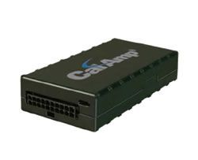

# CalmAmp - LMU-2500

The CalAmp LMU-2500 is an ultra-sensitive GPS-based fleet tracking unit that offers next-generation Super-sense GPS technology at an economical price. This tracker is designed to provide accurate and reliable location information for fleet management applications. With its advanced features and robust construction, the LMU-2500 is unrivaled in its class.

One of the standout features of the LMU-2500 is its Super-sense GPS technology. This technology ensures that the tracker can acquire and maintain a GPS signal even in challenging environments, such as urban canyons or dense foliage. This means that fleet managers can rely on the LMU-2500 to provide accurate and up-to-date location information for their vehicles, no matter where they are.

In addition to its GPS capabilities, the LMU-2500 also offers a range of other features that make it an ideal choice for fleet management. It has a backup battery, which ensures that the tracker continues to operate even if the vehicle's main power source is disconnected. This is particularly useful in the event of theft or tampering.

The LMU-2500 also has sleep mode functionality, which allows it to conserve power when the vehicle is not in use. This helps to extend the battery life of the tracker and ensures that it is always ready to provide accurate location information when needed.

The LMU-2500 is housed in a durable plastic casing, which protects it from the elements and ensures that it can withstand the rigors of daily use in a fleet management environment. It also offers extra connectivity options, such as wireless modules, which allow for seamless integration with other fleet management systems.

Overall, the CalAmp LMU-2500 is a top-of-the-line GPS tracker that offers exceptional performance and reliability. Its Super-sense GPS technology, backup battery, sleep mode functionality, and durable construction make it an ideal choice for fleet management applications. Whether you need to track a small fleet of vehicles or a large fleet of trucks, the LMU-2500 has the features and capabilities to meet your needs.

