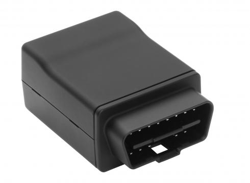

# CalmAmp - LMU-3030

The CalmAmp LMU-3030 is a versatile GPS tracker that is perfect for a range of automotive applications. Whether you need it for automotive insurance, driver behavior management, auto rental, or any other automotive application that requires access to the vehicle diagnostics interface \(OBD-II\), the LMU-3030 has you covered.

One of the standout features of the LMU-3030 is its small size, which makes it easy to install and eliminates the need for professional installation. It also boasts superior GPS performance, ensuring accurate tracking of vehicle speed and location. Additionally, the LMU-3030 is equipped with a 3-axis accelerometer, which allows it to detect hard braking, cornering, acceleration, and capture pre and post-impact data.

With the LMU-3030, you can rely on a reliable communications link between the device and your application servers. Messages are transported across the cellular network using enhanced SMS or UDP messaging, ensuring seamless communication. The tracker also features CalAmp's advanced on-board alert engine, PEG™ \(Programmable Event Generator\), which allows you to monitor external conditions and set up custom exception-based rules to meet your specific application requirements.

Furthermore, the LMU-3030 offers over-the-air serviceability through CalAmp's management and maintenance system, PULS™ \(Programming, Updates, and Logistics System\). This allows for easy configuration parameter updates, PEG rule changes, and firmware upgrades without the need for manual intervention. With PULS, you can monitor the health status of the LMU-3030 across your fleet, ensuring any issues are identified and addressed before they become costly problems.

### Key Features:

- Small size and easy installation
- Superior GPS performance
- OBD-II interface for vehicle diagnostics
- Backup battery
- 3-axis accelerometer for detecting vehicle movements
- Enhanced SMS or UDP messaging for reliable communication
- Advanced on-board alert engine for custom rule monitoring
- Over-the-air serviceability for easy configuration and firmware updates

