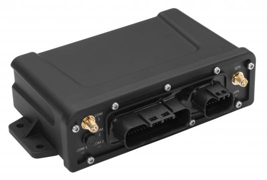

# CalmAmp - LMU-4520

The CalmAmp LMU-4520 is a versatile GPS tracker designed specifically for the mining and construction industries. With its dual-mode satellite and cellular communications, this device ensures reliable and continuous tracking and messaging capabilities, even in remote locations. Its weatherproof design and IP67 environmental rating make it suitable for use in harsh and rugged environments.

One of the standout features of the LMU-4520 is its extensive fleet management capabilities. It offers a full set of fleet management features, including 16G accelerometers for measuring motion, driver behavior, and impact events. The device also has multiple interfaces, such as two switched power serial ports and Mobile Data Terminal \(MDT\) support, allowing for seamless integration with existing systems. Additionally, the optional jPOD™ ECU interface enables real-time monitoring of heavy-duty engine conditions and data, providing valuable insights into vehicle health.

The LMU-4520 is highly flexible and expandable, allowing for cost-effective scalability as your fleet management needs evolve. It utilizes CalAmp's industry-leading on-board alert engine, PEG™ \(Programmable Event Generator\), which enables the monitoring of external conditions and the creation of custom rules to meet specific application requirements. This device also benefits from CalAmp's over-the-air device management and maintenance system, PULS™ \(Programming, Updates, and Logistics System\), which allows for easy configuration updates and firmware upgrades without the need for physical access to the device.

With its robust features, rugged design, and advanced fleet management capabilities, the CalmAmp LMU-4520 is an ideal GPS tracker for the mining and construction industries, providing reliable and efficient tracking and monitoring of your valuable assets.

