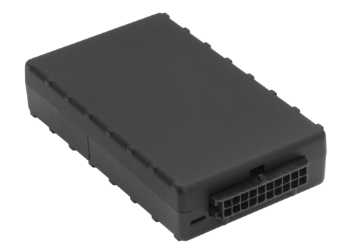

# CalmAmp - LMU-900

The CalmAmp LMU-900 is a versatile GPS tracker designed for easy and reliable installation in automobiles. It is an ideal solution for various applications such as small fleets, automotive insurance, stolen vehicle recovery, vehicle finance, auto rental, and other vehicle tracking and trace or AVL \(Automatic Vehicle Location\) applications. 

The LMU-900 features a compact size and superior GPS performance, ensuring accurate and reliable tracking of vehicles. It is equipped with a 3-axis accelerometer for motion and tilt sensing, allowing for advanced monitoring capabilities. The tracker also offers ultra-low power sleep modes, maximizing battery life and reducing power consumption. 

With four inputs and four outputs \(I/O\), the LMU-900 provides flexibility for integrating with external devices and sensors. This allows for customization and expansion of the tracker's functionality to meet specific application requirements. 

Installation of the LMU-900 is hassle-free, thanks to its compatibility with GSM/GPRS/CDMA 1x RTT and HSPA cellular networks. It can be easily mounted anywhere in a 12 or 24 volt mobile vehicle, with options for internal or external antenna. 

The LMU-900 utilizes enhanced SMS or UDP messaging to transport data across the cellular network, ensuring reliable communication between the tracker and application servers. It also incorporates CalAmp's advanced on-board alert engine, PEG \(Programmable Event Generator\), which allows for monitoring of external conditions and supports customer-defined rules for exception-based notifications. 

Additionally, the LMU-900 offers over-the-air serviceability through CalAmp's management and maintenance system, PULS \(Programming, Updates, and Logistics System\). This enables remote configuration, firmware updates, and monitoring of unit health status, ensuring optimal performance and minimizing downtime. 

In summary, the CalmAmp LMU-900 is a feature-rich GPS tracker that combines advanced technology, flexibility, and ease of use. It is a reliable solution for tracking and monitoring vehicles in various industries, providing valuable insights and enhancing operational efficiency.

