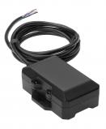

# CalmAmp - TTU-1200

The CalmAmp TTU-1200 is a rechargeable battery pack trailer tracking device that is designed for reliable, long-term deployments. It is the perfect solution for managing assets that are typically connected to 12 or 24 volt systems but may remain idle for extended periods of time. 

Featuring a small size and superior GPS performance, the TTU-1200 is equipped with an internal 3.8 Ah battery and three Inputs/Outputs \(I/O\). This complete vehicle tracking and communications device utilizes next-generation, super-sensitive GPS technology on GPRS, CDMA, and HSPA cellular networks, making it compatible with any 12 or 24 volt mobile vehicle. The device is designed with superior internal antennas for both cellular and GPS, eliminating the need for wired antennas and allowing for easy and cost-effective installations anywhere in the vehicle. 

The TTU-1200 utilizes enhanced SMS or UDP messaging to transport messages across the cellular network, ensuring a reliable communications link between the device and your application servers. With its advanced on-board alert engine, PEG \(Programmable Event Generator\), the TTU-1200 offers exceptional flexibility. PEG continuously monitors the vehicle environment and responds instantly to pre-defined threshold conditions, such as time, date, motion, location, geo-zone, input, and other event combinations. This allows for a customized application that meets the specific requirements of your business. 

Additionally, the TTU-1200 leverages CalAmp's over-the-air device management and maintenance system, PULS \(Programming, Updates, and Logistics System\). This system allows for easy configuration parameter updates, PEG rule modifications, and firmware upgrades, all done remotely. With PULS, you can monitor the health status of units across your fleet, enabling you to quickly identify and address any issues before they become costly problems. 

Overall, the CalmAmp TTU-1200 is a reliable and versatile tracking device that offers exceptional performance and flexibility for managing your assets. Whether you need to track trailers, vehicles, or other mobile assets, the TTU-1200 is an ideal choice.

