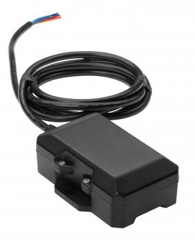

# CalmAmp - TTU-2830

The CalmAmp TTU-2830 is a weatherproof trailer tracking device built for reliable, long term deployments. It combines a small enclosure with a 5.2 Ah internal rechargeable battery pack and superior GPS sensitivity, making it suitable for assets that are normally connected to 12 or 24 volt systems but may be disconnected for periods of time. The unit includes multiple inputs and outputs for flexible integrations and uses internal antennas to simplify mounting and reduce installation complexity.

As a Plaspy compatible device, the TTU-2830 can deliver consistent position and event data into the Plaspy platform for fleet and asset visibility. Its built in programmable event engine (PEG) and over the air management system (PULS) make it practical for operational fleets and asset managers who need remote monitoring, configurable alerts, and device health oversight within Plaspy-driven workflows.

## Key Highlights

- Weatherproof enclosure designed for trailer and outdoor asset deployments
- Internal 5.2 Ah rechargeable battery for extended off power operation
- Compact form factor with superior GPS sensitivity for improved location accuracy
- Internal cellular and GPS antennas to simplify installation and reduce add ons
- Three inputs and three outputs for flexible event monitoring and control
- On board PEG alert engine and PULS over the air management for remote updates and rule adjustments

## How It Works with Plaspy

Plaspy consumes the TTU-2830 position messages and event notifications to present real time visibility and historical reporting for assets and fleets. The device's programmable alerts and over the air capabilities complement Plaspy's alerting and device management features, allowing teams to translate device events into platform alarms, dashboards, and reports.

- Receive live and periodic location updates in Plaspy for trailer and asset tracking
- Map PEG generated events to Plaspy alerts for motion, geo zone, input state, and custom thresholds
- Monitor device status and battery condition in Plaspy to plan maintenance or redeployments
- Use event driven messages from the device to trigger notifications, reports, and operational workflows
- Apply Plaspy reporting to analyze asset utilization, dwell time, and location history

## Typical Use Cases

- Trailer tracking for fleets that frequently detach and leave trailers unattended
- Rental equipment and portable asset monitoring where devices may be off vehicle power
- Long term yard and depot tracking for high value assets with intermittent connectivity
- Logistics and intermodal asset visibility during staging and transit
- Remote deployments where weatherproofing and internal power are required

## Why Choose This Tracker with Plaspy

The TTU-2830 is a practical choice when you need a compact, weatherproof tracker with internal power and flexible input/output capabilities. Its internal antennas and enhanced GPS sensitivity help keep installation simple while maintaining reliable location reporting for asset centric applications. When paired with Plaspy, the device's event engine and OTA management support routine operations like alerting, remote configuration, and health monitoring without frequent physical access.

Because the TTU-2830 is compatible with Plaspy, fleet managers can integrate device events and position feeds into Plaspy dashboards and workflows to gain operational insight across detached trailers and intermittently powered assets. To learn more about how Plaspy supports fleet and asset tracking, visit our main website https://www.plaspy.com. Product specifications and availability can change over time, so please verify current details and technical documentation with the manufacturer at http://www.calamp.com/.
