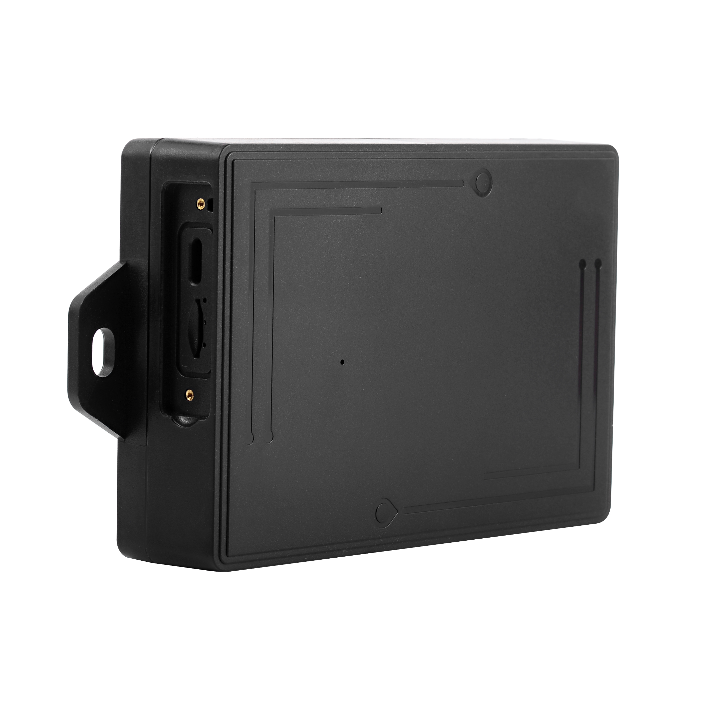

# CanTrack - 10000mAh

The CanTrack 10000mAh (GF60 series) is a heavy duty magnetic asset GPS tracker designed for long duration outdoor deployments. Marketed with a 10000mAh capacity and a documented rechargeable cell of 6000mAh, the GF60 series combines a rugged IP67 rated enclosure and a strong magnetic mount to provide zero installation mounting for vehicles, trailers and containers. It is positioned for use cases such as vehicle finance management, stolen vehicle recovery and extended container tracking where discreet, reliable location reporting is required.

This model is compatible with Plaspy and can be configured to send live positioning and alarm data into the Plaspy platform. With support for remote configuration via SMS and server settings such as APN and server IP/port, the 10000mAh tracker can be integrated into Plaspy to provide real time location, historical route playback and alarm notifications while balancing reporting frequency and battery life for long standby deployments.

## Key Highlights

- Plaspy compatible configuration via APN and server IP/port for live location and event uploads.
- Magnetic mount and zero installation design for quick attachment to vehicles, trailers and containers.
- Rugged IP67 waterproof enclosure and ABS fireproof housing for outdoor and industrial environments.
- Marketed 10000mAh capacity with a documented internal cell of 6000mAh and multi mode reporting to extend standby life.
- Anti tamper and vibration alarms plus light sensor detection for theft and removal alerts.
- Remote configuration options using SMS commands to adjust reporting mode, APN, and server settings.
- Optional remote voice listen in feature available for deployments that need audio monitoring.

## How It Works with Plaspy

When pointed to Plaspy’s server and configured with the appropriate APN settings, the 10000mAh tracker uploads location and status reports so Plaspy can display live positions, playback historical routes and manage alarm events. Plaspy receives the device reports and makes them available for dashboard views, alerts and reporting used by fleet and asset teams.

- Live location updates and telemetry visible in Plaspy for operational oversight and dispatch.
- Geo fence alerts and historical route playback available in Plaspy using the tracker’s reported points.
- Low battery, vibration and anti tamper alerts forwarded to Plaspy for timely notification and response.
- Multi mode reporting supports trading reporting frequency for battery life and is reflected in Plaspy dashboards and alerts.
- Remote SMS configuration enables field adjustments when network conditions limit direct platform changes.
- Optional voice listen in can be configured for deployments that require audio context alongside GPS data.

## Typical Use Cases

- Stolen vehicle recovery and covert asset tracking where discrete mounting and anti theft alerts are critical.
- Container and trailer tracking for logistics operations requiring rugged waterproof devices and long deployments.
- Fleet management of off road or heavy duty equipment where wiring is impractical but location history is needed.
- Short term rental and repossession workflows that use geo fences and route playback for operational control.
- Remote asset surveillance where long standby, tamper detection and configurable reporting reduce maintenance visits.

## Why Choose This Tracker with Plaspy

The CanTrack 10000mAh GF60 series is a practical choice for organizations that need a rugged, easy to mount tracker with flexible reporting modes. Its magnetic, waterproof form factor and remote configuration options make it suitable for discreet deployments where low maintenance and long standby are priorities. Configuring the device to send data to Plaspy is straightforward, enabling timely location visibility, alarms and historical playback within Plaspy's fleet monitoring workflows.

If you want to learn more about how Plaspy can work with magnetic asset trackers like the CanTrack 10000mAh, visit https://www.plaspy.com to explore platform features and deployment options. Product specifications, availability and manufacturer details can change over time, so verify current specifications and documentation with the manufacturer at https://www.cantrackgps.com/.
