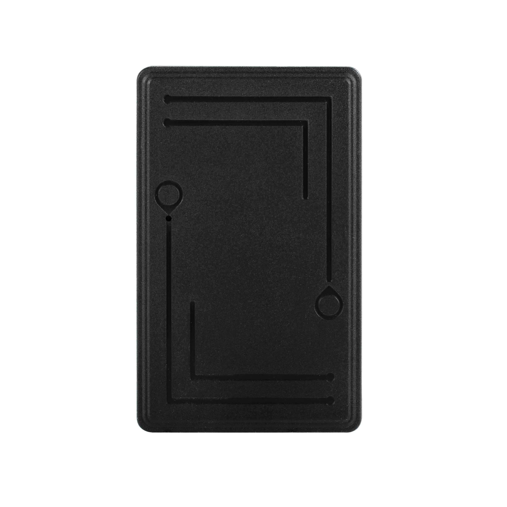

# CanTrack - 3000mAh

The CanTrack 3000mAh (GF40) is a rechargeable magnetic asset GPS tracker designed for long duration, covert mounting on vehicles and high value equipment. It pairs a strong magnet and durable ABS housing with configurable reporting modes to balance update frequency and battery life. Typical capabilities include real time and interval reporting, tamper and vibration alerts, geofence notifications, and optional remote voice listen in, making the device suitable for discreet location monitoring of trailers, containers, and other movable assets.

As a Plaspy compatible device, the 3000mAh model can feed location and status data into the Plaspy platform for centralized visibility and operational oversight. Integration enables fleet and asset managers to see live positions, receive alarms and low battery notices, and adjust device reporting behavior through remote commands or platform settings. That compatibility makes the tracker a practical option when you want covert hardware combined with a robust monitoring and reporting platform like Plaspy.

## Key Highlights

- Plaspy compatible magnetic asset tracker providing reliable real time tracking and status reporting.
- Rechargeable 3000mAh battery with extended standby performance to support long duration monitoring.
- Multiple working modes including real time, interval, and clock based reporting to balance accuracy and battery life.
- Security oriented alerts such as geofence notifications, vibration and tamper alarms, and low battery warnings.
- Rugged, covert design with ABS fireproof housing and a strong magnet for tool free mounting on metal surfaces.
- Remote configuration and control via SMS commands or platform settings to tune reporting and alerts.

## How It Works with Plaspy

When connected to Plaspy, the CanTrack 3000mAh streams location and device status over cellular networks to provide centralized tracking, alerting, and reporting. Plaspy receives position updates and telemetry, applies configured geofence and alarm rules, and surfaces events to operators for timely action. Remote command support enables adjustments to reporting intervals and alarm thresholds without physical access to the tracker.

- Live location and telemetry visible in Plaspy including position updates and battery status.
- Geofence and vibration tamper alerts forwarded to Plaspy for immediate notification and response.
- Low battery and device health reports routed to Plaspy to help prevent unexpected downtime.
- Optional remote voice listen in available where permitted for security verification workflows.
- Remote configuration through SMS or platform controls to optimize reporting intervals and device behavior.

## Typical Use Cases

- Long term tracking of trailers, rental equipment, and leased units for improved utilization and recovery.
- Anti theft monitoring for containers, parked machinery, and high value assets with geofence and tamper alerts.
- Construction site asset oversight where discreet mounting and extended standby life are important.
- Remote inventory and logistics monitoring for seasonal or off site assets needing periodic position updates.

## Why Choose This Tracker with Plaspy

The CanTrack 3000mAh is a practical choice for organizations that need a covert, durable tracker with configurable reporting and long battery life. Its combination of magnetic mounting, configurable working modes, and alerting features aligns well with Plaspy workflows that prioritize centralized visibility, event driven notifications, and straightforward remote management. For fleet and asset managers, pairing this hardware with Plaspy helps consolidate location data and alerts in a single platform for easier operational oversight.

To learn more about how Plaspy can work with CanTrack devices visit https://www.plaspy.com. Product specifications and availability can change over time, so please verify current technical details and support information on the manufacturer site https://www.cantrackgps.com/.
