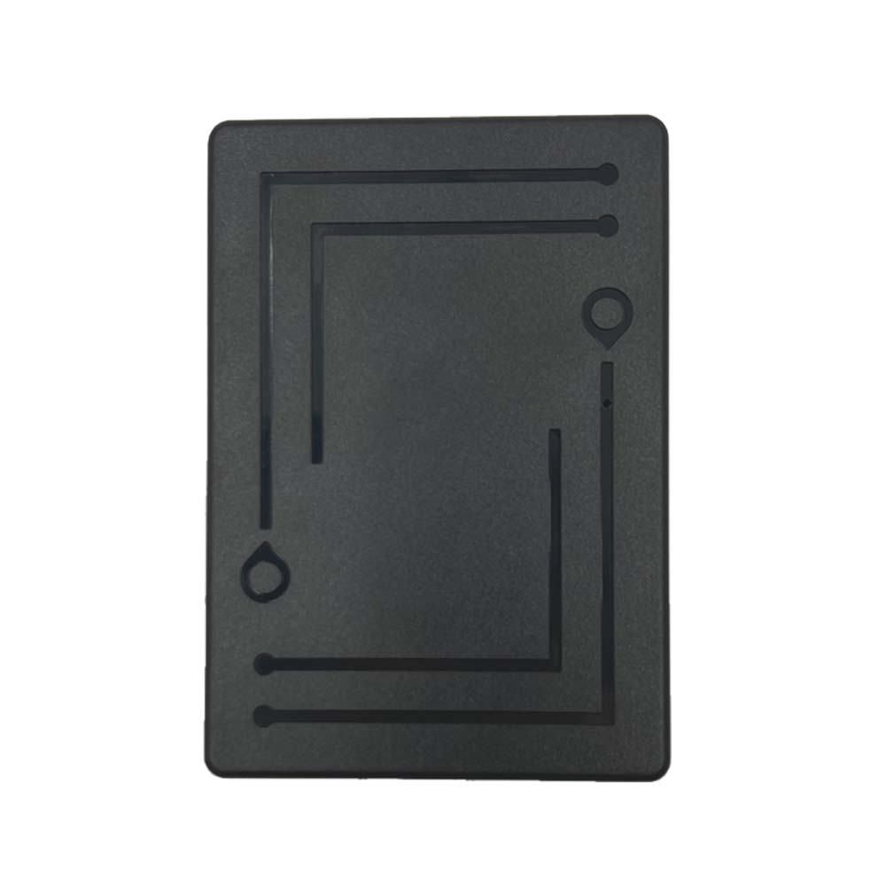

# CanTrack - 6000mAh

The 6000mAh Magnetic Asset GPS Tracker \(model GF50\) is a rugged, Plaspy compatible GPS tracker engineered for long-term covert asset protection, stolen vehicle recovery, and fleet management. With a powerful 6000mAh rechargeable battery, IP67 waterproof enclosure, and an N54-grade strong magnet for tool-free mounting on metal surfaces, the GF50 delivers dependable real-time tracking and historical playback through web and mobile platforms powered by Plaspy.

Designed to balance battery life and reporting frequency, the GF50 supports multiple working modes \(real-time, interval, clock/wakeup\) that Plaspy can manage centrally to optimize telemetry and tracking costs. Anti-tamper alerts, geo-fence notifications, vibration alarms and low-battery warnings make this magnetic asset GPS tracker a practical choice for covert installation on trailers, containers, heavy machinery and other high-value assets.

## Key Highlights

- Long-life 6000mAh rechargeable battery: standby from ~7 to 365 days depending on mode and reporting interval, ideal for long-term asset tracking.
- Plaspy compatible for real-time tracking and historical playback across web and mobile apps.
- Rugged, IP67 waterproof ABS enclosure with N54 strong magnet for secure, tool-free mounting on metallic surfaces.
- Multi-band cellular support \(2G and 4G/LTE variants\) for wide network compatibility and reliable telemetry delivery.
- Comprehensive security alerts: anti-tamper, geo-fence, vibration alarms and low-battery notifications.
- Flexible reporting modes \(real-time, interval, clock/wakeup\) configurable via SMS or platform settings for tailored power management.
- Compact, covert form factor suited to trailers, containers, heavy equipment and other fleet assets.

## How It Works with Plaspy

When integrated with Plaspy, the GF50 streams GPS fixes, status updates and alarm events to the platform for instant display, rule-based alerts, and historical route reconstruction. Plaspy ingests the device’s telemetry and exposes it through dashboards, geofencing rules, scheduled reports and push/SMS notifications so fleet managers and security teams can act quickly on anti-theft events or operational exceptions.

- Real-time location and telemetry updates to Plaspy for live monitoring and map visualization.
- Alert forwarding: anti-tamper, geo-fence breaches, vibration alarms and low-battery notifications appear in Plaspy with timestamps and location context.
- Multiple reporting modes: switch between high-frequency real-time tracking and power-saving interval/clock modes via SMS or Plaspy settings.
- Historical tracks and playback: Plaspy archives position history for audits, route analysis and recovery operations.
- Optional remote voice listen-in is supported by the device \(where enabled\) and can be associated with security incidents logged in Plaspy.

## Technical Overview

| Model | 6000mAh Magnetic Asset GPS Tracker \(GF50\) |
| --- | --- |
| Connectivity | GSM/GPRS \(2G\) and LTE \(4G\) variants; GPRS Class 12 \(TCP/IP\) |
| Bands | LTE-FDD: B1/B2/B3/B4/B5/B7/B8/B28/B66; LTE-TDD: B34/B38/B39/B40/B41; 2G GSM: 850/900/1800/1900 MHz |
| Battery & Power | Rechargeable 6000mAh; standby ~7–365 days depending on activity and reporting interval; working current 100 µA–100 mA; standby 60–100 µA/h |
| Size & Weight | 80 x 56 x 27 mm; 0.23 kg |
| Housing & Mounting | ABS fireproof enclosure, IP67 waterproof, N54 strong magnet for metallic attachment |
| GNSS | GPS L1 1575.42 MHz, 66 channels; location accuracy &lt; 5 m; tracking sensitivity -165 dBm; acquisition sensitivity -148 dBm; hot start ≤ 1 s, cold start ≤ 32 s \(open sky\) |
| Antennas & Chipset | Built-in quad-band GSM antenna and ceramic GPS antenna; MTK6261 + AT6558R GPS \(2G versions\); SIMCom A7670 Series + AT6558R GPS \(4G versions\) |
| Memory | 32 + 32 Mb |
| Operating Range | Temperature: -20 °C to +70 °C |
| Configuration | Remote configuration via SMS commands and server/platform settings \(APN, IP/port, reporting modes, time zone, factory reset\) |

## Use Cases

- Covert trailer and container tracking for theft recovery and location verification during transport.
- Heavy machinery and construction asset protection where long standby and strong magnetic mounting are required.
- Fleet asset finance monitoring and repossession support with historical routes and tamper alerts.
- Remote, long-term asset surveillance in harsh environments where waterproofing and durable attachment matter.

## Why Choose This Tracker with Plaspy

The GF50 magnetic asset GPS tracker delivers a balanced solution for organizations that need Plaspy compatible real-time tracking with the endurance and concealment required for long-term asset protection. Its 6000mAh battery and configurable reporting modes reduce maintenance cycles and operating costs while preserving the ability to escalate to high-frequency telemetry during incidents. Multi-band cellular support and robust GNSS performance ensure reliable location delivery to Plaspy dashboards for rapid decision-making.

For fleet managers and security teams, the GF50 combines practical anti-theft features \(anti-tamper, geo-fence, vibration alarms\) with a secure magnetic mounting that’s difficult to spot and easy to install. While the tracker focuses on core GPS and telemetry, Plaspy can correlate GF50 position and alarm data with other vehicle systems—such as fuel monitoring, ignition/immobilizer logs or Bluetooth sensor feeds—when those systems are present in your broader telematics setup, enabling comprehensive fleet management and forensic analysis.

Choose the GF50 when you need a Plaspy compatible GPS tracker that prioritizes long battery life, rugged mounting, flexible reporting and proven positioning performance for asset protection, fleet management and stolen vehicle recovery.

