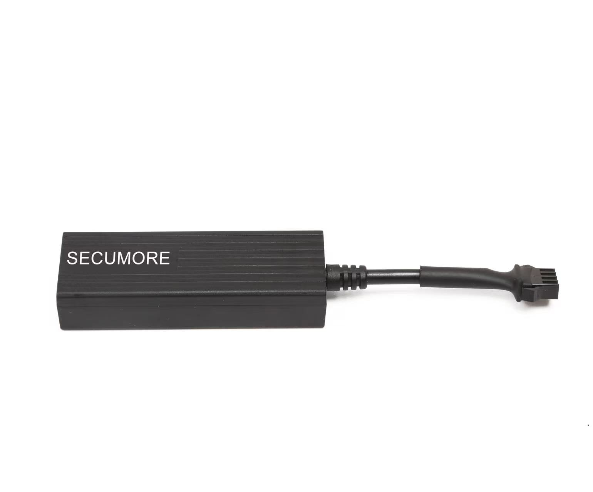

# CanTrack - C32

The CanTrack C32 is a versatile GPS tracker designed for vehicles, motorcycles, and E-bikes with a voltage range of 9 to 90V. With its compact size and advanced features, it provides real-time tracking and monitoring capabilities for your vehicles. Whether you want to keep an eye on your fleet, track your motorcycle, or monitor your E-bike, the C32 is the perfect solution.

One of the standout features of the C32 is its ability to report the real-time location of your vehicle. With this information, you can easily track the whereabouts of your vehicle and ensure its safety. Additionally, the C32 allows you to remotely control the engine, giving you the ability to start or stop your vehicle with just a few clicks. This feature can be particularly useful in case of theft or unauthorized use of your vehicle.

Another great feature of the C32 is its ability to read the status of your car's air conditioner remotely. This allows you to check the temperature inside your vehicle and adjust it accordingly, ensuring a comfortable ride every time. Additionally, the C32 supports the GT06 protocol and OTA \(Over-The-Air\) functions, allowing for easy remote upgrades and updates.

With its wide voltage range, real-time tracking capabilities, and advanced features, the CanTrack C32 is the perfect GPS tracker for your vehicles, motorcycles, or E-bikes. Whether you're a fleet manager, a motorcycle enthusiast, or an E-bike owner, the C32 will provide you with the peace of mind and security you need.

### Key Features:

- 9-90V Vehicle/scooter/motorcycle tracking
- Real-Time Tracking
- Cut fuel/Resume fuel \(Optional\)
- Power removal/Ignition/Vibrate alarm
- Support angle upload location
- Support 1500 data memory storage
- Remote upgrade via OTA
- External voltage detection

