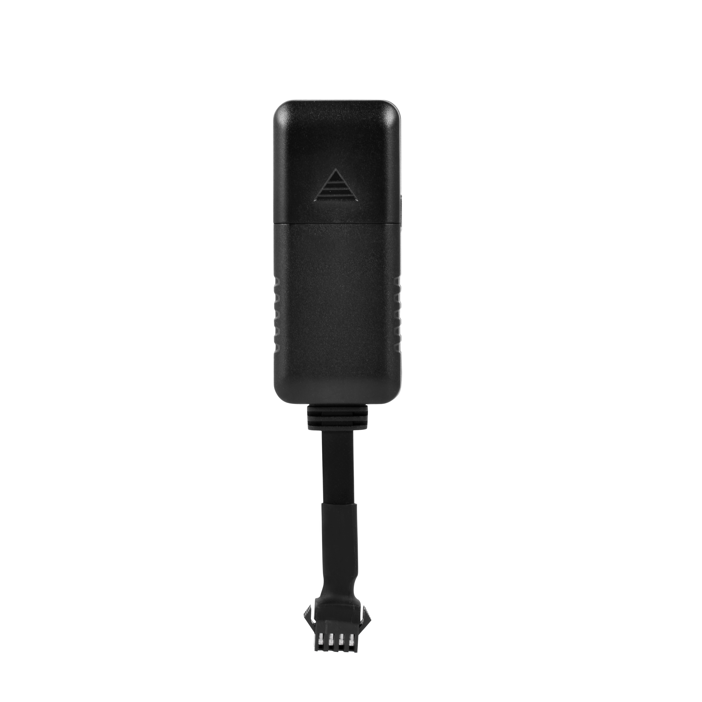

# CanTrack - C32Plus

The CanTrack C32Plus is a compact hard wired GPS tracker designed for 9–90V vehicles such as e bikes, motorcycles, scooters and cars. It is built around a high sensitivity MTK GNSS chipset and provides real time position reporting, offline data buffering and remote maintenance features in a small rugged form factor suited to light vehicle and fleet deployments.

This model is compatible with Plaspy when configured to send GT06 style messages to Plaspy's server, making it a practical option for organizations that want to add a small footprint tracker to their Plaspy managed fleet. Its combination of reliable positioning, low power draw and offline storage helps keep location and event data flowing into Plaspy even in intermittent coverage scenarios.

## Key Highlights

- Plaspy compatible device that can be pointed to Plaspy servers for live tracking and alerts.
- High sensitivity MTK GNSS chipset delivering sub 10 meter positioning for dependable location reports.
- Wide vehicle voltage range suitable for e bikes, motorcycles, scooters and cars.
- Low power consumption designed to reduce battery drain on smaller vehicles and assets.
- Internal buffering stores up to 1,500 location records for upload after connectivity is restored.
- Supports remote maintenance such as OTA firmware upgrades and optional remote engine cut and resume.
- Event inputs for ignition, power removal and vibration provide actionable alerts for operations teams.

## How It Works with Plaspy

When configured to communicate with Plaspy, the C32Plus forwards position updates, alarms and status inputs to the Plaspy platform so fleet managers and security teams gain continuous visibility. Integration leverages the device protocol and TCP IP transport to ensure Plaspy receives periodic telemetry and event data for monitoring, alerting and reporting.

- Real time location updates and telemetry delivered to Plaspy for map based tracking.
- Alarms for ignition, power removal and vibration appear in Plaspy as events that can trigger notifications.
- Buffered records stored during coverage gaps upload automatically to Plaspy when connectivity returns.
- Optional remote immobilizer or engine cut and resume commands can be coordinated through Plaspy where enabled.
- Telemetry fields such as external voltage and status inputs map to Plaspy dashboards and reports for operational oversight.

## Typical Use Cases

- Fleet management for light commercial vehicles where compact hardware and reliable positioning are required.
- Anti theft monitoring and recovery for motorcycles, scooters and e bikes using vibration and power removal alerts.
- Small vehicle and scooter fleet operations that need low maintenance trackers with offline buffering.
- Remote monitoring programs that must preserve historical routes and telemetry during intermittent cellular coverage.
- Installations that benefit from OTA updates and centralized device management for large numbers of units.

## Why Choose This Tracker with Plaspy

The C32Plus is a practical choice for teams using Plaspy who need a small, low power tracker that still offers professional features like offline buffering, OTA updates and optional remote immobilization. Its GT06 compatibility and TCP IP transport make server configuration straightforward, while the MTK GNSS chipset provides reliable position data for mapping and reporting in Plaspy.

If your deployment involves motorcycles, scooters, e bikes or compact vehicles where space and power are constrained, the C32Plus provides a balance of size, ruggedness and operational features that work well with Plaspy for real time tracking, event driven alerts and fleet reporting. Learn more about Plaspy on the main website https://www.plaspy.com. Product specifications and availability can change over time, so please verify current details with the manufacturer at https://www.cantrackgps.com/.
