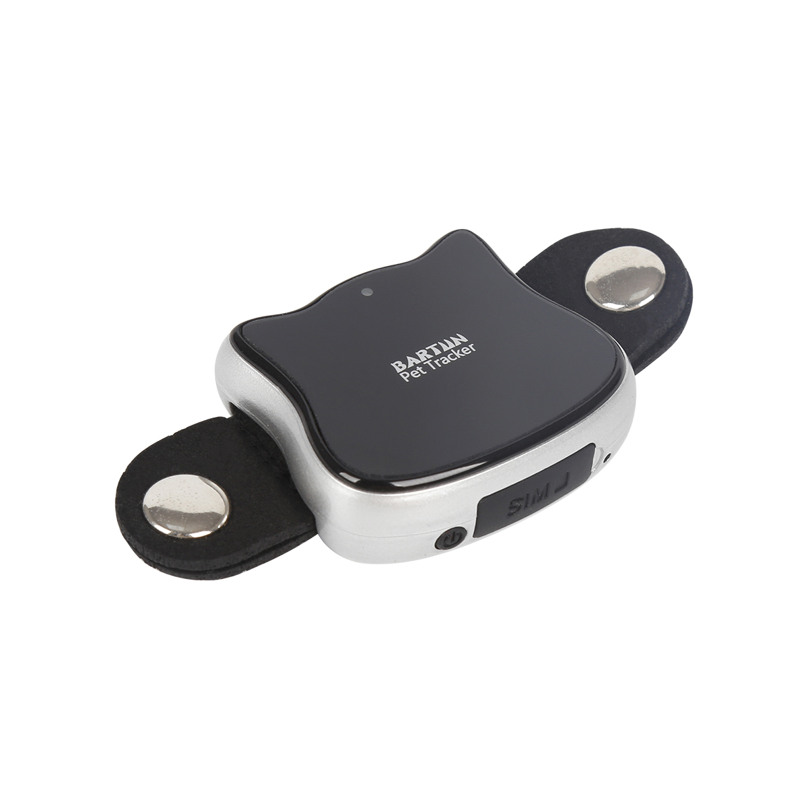

# CanTrack - G02M

The CanTrack G02M is a compact GPS tracker marketed as a pet tracker with practical applications for vehicle monitoring. It uses GPS satellites together with cellular communication to determine location and report position data. The device can send location updates via SMS and can also transmit data to an internet server, enabling visualization on mapping services such as Google Maps and Google Earth.

As a Plaspy compatible model, the G02M can feed location data into the Plaspy platform so teams can monitor devices centrally. That compatibility makes the G02M a candidate for small vehicle fleets, personal vehicle tracking, pet recovery, and other scenarios where discrete, periodic location reporting and geofence alerts are valuable. Plaspy can surface the tracker data for live monitoring, alerts, and historical review.

## Key Highlights

- Compact and lightweight form factor suitable for discreet placement and mobile use
- Real time position reporting using GPS together with cellular communication
- Multiple reporting options including SMS notification and data upload to an internet server
- Supports geofence alarms to notify when the device enters or exits predefined areas
- Low battery alert to help maintain continuous tracking availability
- Flexible upload interval settings to balance update frequency and power use

## How It Works with Plaspy

Plaspy can receive and process the G02M location reports so fleet managers and device owners can see positions on a central map, review history, and configure alerts. Integration focuses on translating the tracker upload events into actionable items inside the Plaspy dashboard.

- Live location display on Plaspy maps for real time visibility
- Historical route playback and position history for operational review
- Geofence alerting delivered through Plaspy notifications and reporting
- Battery and status alerts surfaced in Plaspy for maintenance oversight
- Configurable reporting intervals reflected in Plaspy data retention and reporting

## Typical Use Cases

- Personal vehicle tracking for theft deterrence and recovery
- Small fleet monitoring where compact trackers are preferred
- Pet or small asset location where discreet size is important
- Temporary or rental vehicle oversight with on demand tracking
- Route and movement analysis for small scale operational planning

## Why Choose This Tracker with Plaspy

The G02M is a practical option when you need a small, straightforward tracker that can report location by SMS or push data to a server. Its compact dimensions and support for geo fencing make it suitable where discreet installation and basic alerting are priorities. When paired with Plaspy, the tracker’s location feeds become part of a broader monitoring and reporting workflow, enabling teams to consolidate visibility across devices and manage notifications centrally.

Because the G02M supports both direct messaging and server uploads, organizations can choose the reporting method that best fits their operational needs and then use Plaspy to unify display, alerts, and historical analysis. If your requirements emphasize simple device management, consistent location reporting, and visual mapping, the G02M with Plaspy is a sensible combination.

To learn more about how Plaspy can work with compatible trackers like the CanTrack G02M visit https://www.plaspy.com. Product specifications, availability, and manufacturer details can change over time so please verify the current technical information on the official CanTrack website https://www.cantrackgps.com/.
