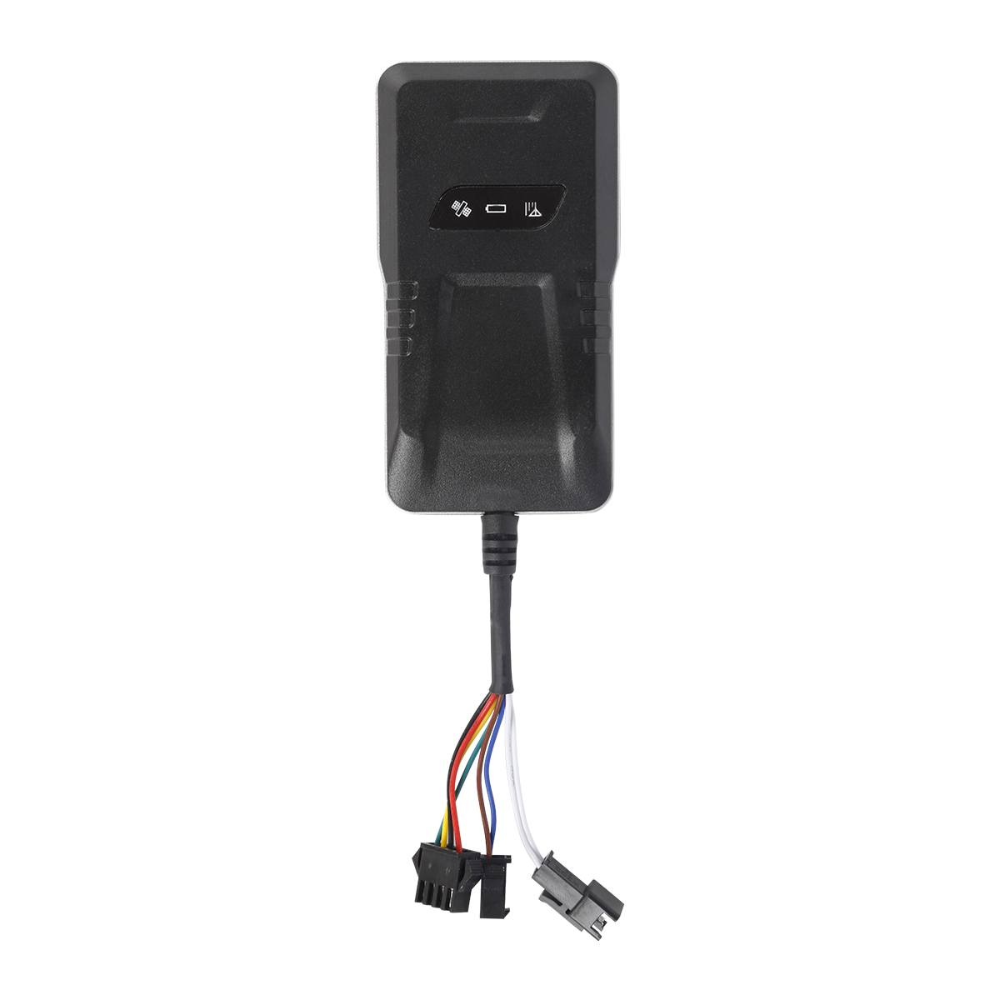

# CanTrack - G05N

# G05N Vehicle Tracker

The G05N Vehicle Tracker is a hard-wired GPS tracker built for permanent vehicle installation and Plaspy compatible integration. Using GSM/GPRS networks and GPS satellites, the G05N delivers reliable, real-time tracking and telemetry to Plaspy-enabled platforms via SMS or GPRS \(TCP/IP\). It is designed for fleet management, insurance telematics and anti-theft applications where remote control, continuous power and robust alerting are required.

The G05N combines precise position reporting with vehicle status monitoring—ignition \(ACC\) detection, overspeed and geo-fence alerts, vibration and angle-change alarms, plus a dedicated SOS button. Plaspy compatibility means fleet managers and service providers can ingest position updates, alarms and remote commands into a single platform for centralized monitoring, reporting and rapid response.

## Key Highlights

- Plaspy compatible GPS tracker providing real-time tracking via GPRS \(TCP/IP\) and SMS for rapid integration.
- Remote immobilizer capability \(cut-off oil/circuit\) for effective anti-theft response and vehicle recovery.
- On-board data buffering — stores up to 1,400 GPS points when GSM signal is lost and auto-uploads when reconnected.
- Comprehensive alerting: geo-fence, overspeed, vibration, angle-change, power-cut and SOS emergency alerts.
- Permanent hard-wired installation with wide input range \(9–36V DC\) and low-power sleep mode plus heartbeat signaling to conserve battery.
- Accurate GNSS performance with MT6261 + RDA6625e chipset, typical accuracy under 10 meters and fast TTFF times.
- Compact, lightweight form factor \(90 × 49.3 × 16.7 mm; 50 g\) suited to cars, motorcycles and small commercial vehicles.

## How It Works with Plaspy

When installed and powered, the G05N continuously monitors GNSS position and vehicle telemetry, sending location and event data to Plaspy via GPRS \(TCP/IP\) or SMS. Plaspy-compatible integration lets you visualize live locations, set geo-fences, trigger notifications, and execute remote commands such as immobilization. The device’s local logging ensures no data loss during network interruptions, with automatic upload of stored points once connectivity is restored.

- Real-time location and telemetry updates \(via GPRS TCP/IP or SMS\) to Plaspy for mapping and reporting.
- Ignition \(ACC\) status monitoring and event reporting for driver behavior and route reconstruction.
- Alarms and alerts: geo-fencing, overspeed, vibration, angle-change, power-cut and SOS emergency reports.
- Stored GPS points \(up to 1,400\) upload automatically after GSM reconnection to preserve route history.
- Remote immobilizer commands supported for anti-theft action through the Plaspy platform or SMS.
- Note: the G05N provides rich telemetry and remote control features but does not include dedicated fuel monitoring or Bluetooth sensors.

## Technical Overview

| Connectivity | GSM/GPRS \(TCP/IP\), SMS |
| --- | --- |
| Bands | Quad-band GSM 850 / 900 / 1800 / 1900 MHz \(GPRS Class 12\) |
| Memory | 32 + 32 Mb \(on-board storage for GPS points; up to 1,400 points buffer\) |
| Power & Battery | Working voltage 9–36V DC; built-in 200 mAh \(3.7 V\) lithium manganese backup battery \(standby ~1 hour\); operating current 5–50 mA |
| Interfaces & I/O | Ignition \(ACC\) detection, SOS button input, vibration/angle-change sensor, power-cut detection, remote immobilizer control \(oil/circuit cut\) |
| GNSS | GPS L1 \(1575.42 MHz C/A\) chipset MT6261 + RDA6625e, 66 channels, typical accuracy under 10 m |
| Sensitivity & TTFF | Tracking sensitivity -165 dBm; acquisition -148 dBm; TTFF hot start ≤1 s, cold start ≤32 s |
| GSM Output Power | ~33 ±3 dBm \(850/900 MHz\); ~30 ±3 dBm \(1800/1900 MHz\) |
| Antennas & Indicators | Built-in GSM and ceramic GPS antennas; LED indicators for power/GSM/GPS |
| Bluetooth | Not supported \(no Bluetooth sensors integrated\) |
| Remote Management | SMS commands and online platform/APP control for alerts, settings and remote immobilization |
| Operating Conditions | Operating temperature -20 °C to +70 °C; weight 50 g; dimensions 90 × 49.3 × 16.7 mm |

## Use Cases

- Fleet management: real-time tracking, route history and overspeed alerts for small and medium vehicle fleets.
- Anti-theft protection: remote immobilizer and power-cut alerts reduce theft risk and improve vehicle recovery.
- Insurance telematics: ACC and telemetry data support driving behavior analysis and claims processing.
- Service shops and rental fleets: continuous telemetry, geo-fencing and SOS alerts improve asset control.
- Motorcycle and electric bike tracking: compact hard-wired installation with vibration and angle-change alarms.

## Why Choose This Tracker with Plaspy

The G05N is a practical, Plaspy compatible GPS tracker for organizations that need dependable real-time tracking, robust telemetry and actionable anti-theft features. Its quad-band GPRS connectivity and SMS fallbacks make it suitable for wide-area deployments, while the 1,400-point buffer and automatic upload ensure route continuity even through signal gaps. Remote immobilization and immediate power-cut alarms give fleet managers and vehicle owners direct control to prevent theft and limit losses.

Integrating the G05N with Plaspy provides a centralized platform for vehicle monitoring, alerting and remote commands. The device’s hard-wired design, low-power modes and heartbeat reporting support always-on fleet management without frequent maintenance. If you need a compact, reliable GPS tracker that supports ignition \(ACC\) detection, immobilizer control and rich alerting—while integrating seamlessly into Plaspy for reporting and operations—the G05N is engineered to deliver consistent telemetry and security for vehicles in commercial and consumer environments.

