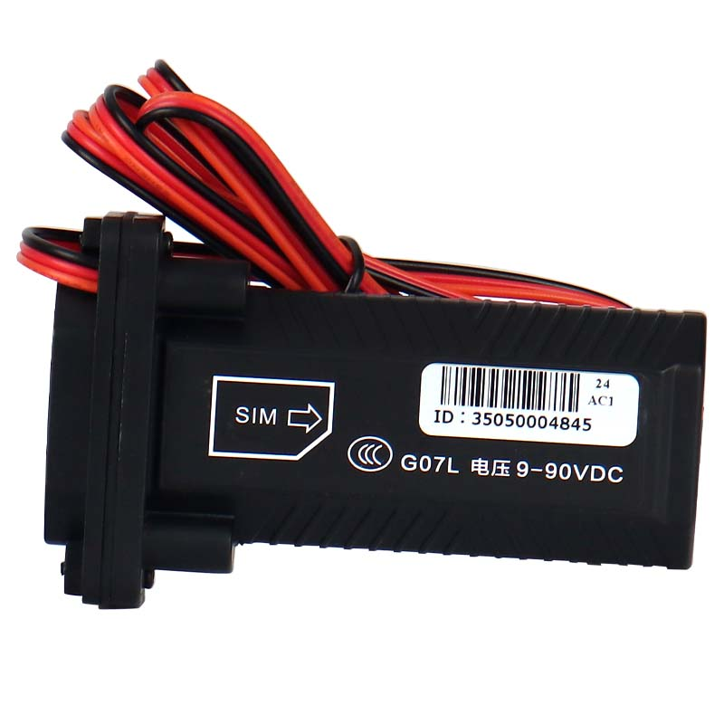

# CanTrack - G07L

The CanTrack G07L is a compact, hard wired 4G GPS tracker designed for a broad range of 9–90 V vehicles. Built around a modern LTE module and chipset, the G07L provides continuous location updates, movement and vibration alarms, ignition status detection, power cut alerts and onboard data buffering. Its design targets fleet and vehicle security use cases where reliable, always available tracking and event reporting are required.

As a Plaspy compatible device, the G07L is optimized to stream location and status updates into Plaspy for live tracking, geofencing and event driven alerts. The tracker supports features that matter to fleet operators and service providers such as high positional accuracy, parking stabilization to reduce GPS drift, configurable reporting modes and offline record storage that automatically syncs once connectivity returns, making it a practical option to integrate with Plaspy workflows.

## Key Highlights

- Real time 4G tracking with fallback connectivity to maintain continuous coverage for fleet operations.
- Wide 9–90 V working range suitable for motorcycles, cars, vans and heavy vehicles in mixed fleets.
- Movement and vibration alarm logic for anti theft detection and tamper notification.
- Ignition status monitoring to support engine runtime reporting and operational oversight.
- Power cut alarm with an internal backup option to preserve last known position and alarm state.
- Local memory buffer capable of storing several thousand records for later upload when connectivity restores.
- Parking stabilization and angle change detection to reduce GPS drift and improve historical track quality.

## How It Works with Plaspy

When connected, the G07L transmits GNSS fixes, status events and alarms over cellular links so Plaspy can ingest those streams and present live positions, alerts and reports. Plaspy uses that telemetry to power visibility, operational monitoring and event driven workflows across web and mobile interfaces.

- Live location and telemetry streaming for accurate vehicle traces and route history in Plaspy.
- Movement and ignition signals are translated into alarms and engine runtime metrics for reporting and notifications.
- Power cut alerts and internal backup preserve critical events and last known position for Plaspy incident workflows.
- Offline storage of recorded points is automatically uploaded to Plaspy when the device regains connectivity, preserving continuity of historical data.
- Remote configuration and platform driven commands reduce field maintenance and support centralized device management within Plaspy.

## Typical Use Cases

- Mixed fleet tracking for cars, vans, trucks and motorcycles where a single device must cover varied vehicle types.
- Anti theft and tamper detection with movement alarms and power loss notifications feeding centralized alerting.
- Long term parking and asset monitoring where parking stabilization and offline buffering maintain accurate history.
- Telematics and operational reporting including route history, utilization and engine run reporting.
- Service and rental fleets where reliable live position and event reporting improve dispatch and recovery workflows.

## Why Choose This Tracker with Plaspy

The G07L offers a balanced feature set for organizations that need dependable cellular connectivity, compact hard wired installation and practical telemetry for fleet oversight. Its wide input voltage range, onboard buffering and configurable reporting modes make it adaptable for mixed fleets and varied operational profiles, while movement and ignition signals provide the event data Plaspy uses for alerts and analytics.

If you are evaluating hardware to integrate with Plaspy, the G07L is a practical choice when you need continuous tracking, anti theft alerts and robust offline handling combined with platform based device management. To learn more about Plaspy visit the main website https://www.plaspy.com. Product specifications, availability and manufacturer details can change over time, so please verify current specifications on the manufacturer's official website https://www.cantrackgps.com/.
