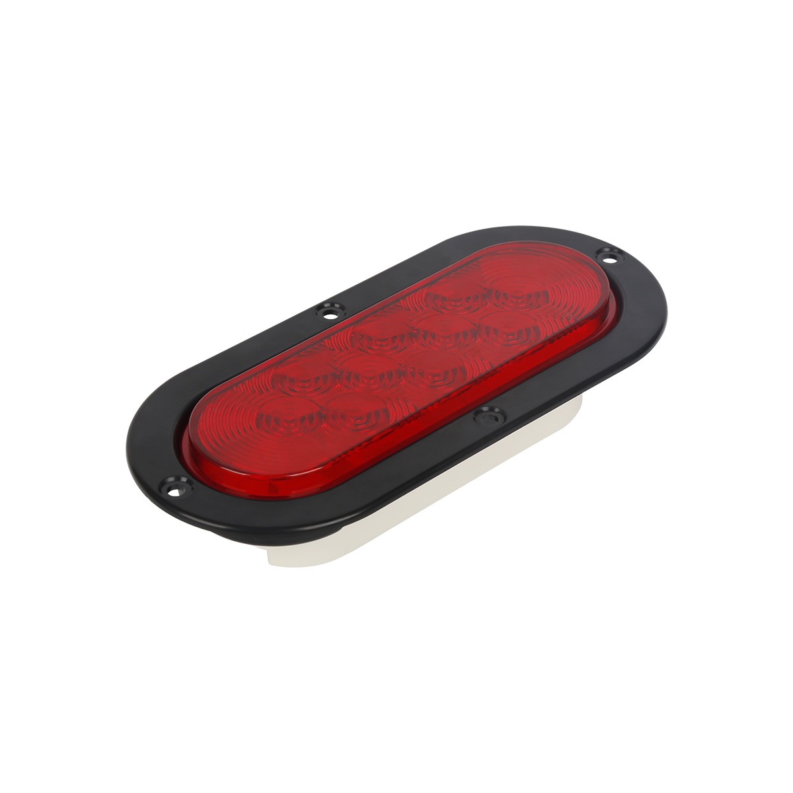

# CanTrack - G09L

The CanTrack G09L is a DOT certified oval type smart tail light GPS tracker designed for trucks and heavy vehicles. It replaces a vehicle tail lamp with a combined lighting and telematics unit, providing conventional tail light functions together with an internal GPS module, motion sensing and an onboard backup battery to maintain reporting when primary power is interrupted. The form factor and certifications make it suitable for heavy duty fleet environments where durability and regulatory compliance matter.

Out of the box the G09L is Plaspy compatible, so fleets can provision devices to forward live location and event data into Plaspy for centralized monitoring. Its integrated design, rugged housing and remote management features make the model a practical choice when operators want discreet tracking tied directly into Plaspy dashboards for real time visibility, alerts and reporting.

## Key Highlights

- Plaspy compatible for centralized real time tracking and fleet management integration
- DOT certified oval tail light form factor that combines lighting with discrete tracking
- Integrated GPS and BeiDou positioning with reported sub 5 meter accuracy and fast warm starts
- Built in motion sensor and internal backup battery to support crash alerts and continued reporting during power interruptions
- 4G LTE connectivity using a widely deployed cellular module for broad coverage and low power operation
- Rugged IP67 housing and remote firmware update support to simplify large scale rollouts

## How It Works with Plaspy

When provisioned for your fleet, the G09L transmits position fixes and event data to Plaspy so operators can monitor vehicles in real time and review historical activity. Plaspy receives device status, location history and alarms and integrates that data into maps, alerts and reports for operational oversight.

- Real time location updates and continuous tracking for fleet visibility
- Driving behavior and crash event reporting to support incident response and analysis
- Geo fence alerts and history playback to verify routes and compliance
- Remote device commands and over the air updates to reduce maintenance visits
- Consolidated alerts and reporting in Plaspy for scheduling, routing and safety oversight

## Typical Use Cases

- Heavy vehicle fleet management with centralized dashboards for route monitoring and compliance
- Theft recovery and covert monitoring using the integrated tail light form factor
- Insurance telematics where driving events and crash alarms aid verification and risk analysis
- On road safety and incident response with timely alerts and event playback in Plaspy
- Contractor and equipment fleets that benefit from combined lighting and tracking in a single unit

## Why Choose This Tracker with Plaspy

Pairing the G09L with Plaspy gives fleet operators a discreet, compliant and rugged option that reduces installation footprint while delivering actionable telemetry. The integrated design minimizes separate hardware needs, and the combination of motion sensing, backup battery and remote update capability helps maintain reliable reporting and fleet scaleability.

For organizations managing trucks and heavy equipment, the G09L provides a purpose built mix of lighting and tracking that fits naturally into Plaspy workflows for monitoring, alerts and reporting. If you need DOT certified hardware with a low visibility install and centralized fleet telemetry, this model is a practical candidate for Plaspy deployments.

Learn more about how Plaspy can integrate with compatible devices and fleet workflows at https://www.plaspy.com. Product specifications and availability can change over time, so please verify current details and certification information on the manufacturer site https://www.cantrackgps.com/.
